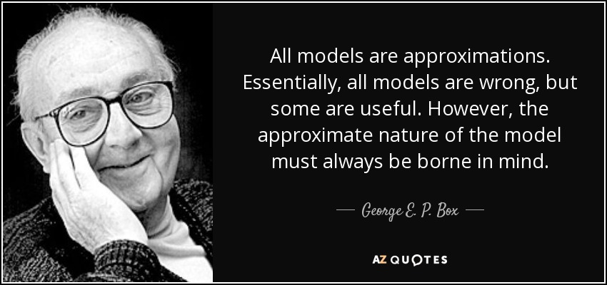

```{r setup, include=FALSE}
knitr::opts_chunk$set(echo = TRUE)
```


# Inferencia Estadística

***Prediction, classification, clustering, and estimation are all special cases of statistical inference. Data analysis, machine learning and data mining are various names given to the practice of statistical inference, depending on the context*** (L. Wasserman, All of Statistics, 2004).

La **inferencia estadística** se ocupa de hacer *afirmaciones* sobre una *población* a partir de la información de una *muestra representativa* de esa población.

La **probabilidad** es un *proceso deductivo* (conclusión específica basándose en premisas generales), mientras que la **inferencia es estadística** es un *proceso inductivo* (conclusión general basándose en casos específicos).

```{r, eval = TRUE, echo=FALSE, out.width="50%", fig.pos = 'H', fig.align = 'center'}

```

### Ejemplo {-}

Sea $X$ una variable aleatoria con distribución Gamma con parámetro de forma $\alpha = 2$ y parámetro de razón $\beta = 3$, i.e., $X\sim\textsf{Gamma}(2,3)$. Calcular la probabilidad de que $X$ asuma un valor mayor que 1.

```{r, fig.align='center'}
# visualización de la función de densidad de X
curve(expr = dgamma(x, shape = 2, rate = 3), from = 0, to = 3, n = 1000, col = 4, lwd = 2, xlab = "x", ylab = "f(x)", main = "")
```

En este caso se tiene que 
$$
\textsf{P}(X > 1) = \int_1^\infty f_X(x)\,\text{d}x = 0.1991\,,
$$
donde $f_X(x)$ es la función de densidad de probabilidad de $X$.

```{r}
# probabilidad de X > 1
round(pgamma(q = 1, shape = 2, rate = 3, lower.tail = F), 4)
```

```{r}
# usando experimentación
set.seed(123)
x <- rgamma(n = 100000, shape = 2, rate = 3)
round(mean(x > 1), 4)
```


# Tipos de inferencia

Existen dos grandes escuelas de **inferencia estadística**:
$$
\text{Inferencia estadística basada en el diseño}
\quad\text{vs.}\quad
\text{Inferencia estadística basada en el modelo}
$$
```{r, eval = TRUE, echo=FALSE, out.width="60%", fig.pos = 'H', fig.align = 'center'}

```

Sterba, S. K. (2009). **Alternative model-based and design-based frameworks for inference from samples to populations: From polarization to integration.** Multivariate behavioral research, 44(6), 711-740.

```{r, eval = TRUE, echo=FALSE, out.width="70%", fig.pos = 'H', fig.align = 'center'}

```


## Inferencia basada en el diseño (descriptiva)

Se basa en un **mecanismo de muestreo aleatorio** bajo control del investigador.

Todos los individuos de la población tienen una probabilidad positiva de ser incluido en la muestra.

Aleatoriedad **empírica** a partir del muestreo aleatorio.

Población **finita tangible**.

Muestras **probabilísticas**.

El objetivo de la inferencia son los parámetros de la población finita.
     
**Pro:**

- La inferencia es de la muestra a una población finita particular.

**Con:**

- Hay que especificar un marco muestral (listado exhaustivo de todas las unidades primarias de muestreo).
- El muestreo aleatorio empírico no siempre es factible.


## Inferencia basada en el modelo (analítica)

Se basa en un **modelo probabilístico** propuesto por el investigador.

Aleatoriedad teórica a partir del modelo probabilístico.

Población **infinita hipotética** (todos los posibles valores que podría generar el modelo).

Muestras **probabilísticas o no probabilísticas**.

El objetivo de la inferencia son los parámetros del modelo probabilístico.

**Pro:**

- Hay un proceso vinculante entre las unidades muestreadas y no muestreadas.
- Se puede hacer inferencias a partir de muestras no aleatorias.

**Con:**

- Hay que especificar un modelo probabilístico que se supone habría generado los datos.
- Se deben verificar empíricamente los supuestos del modelo para que la inferencia goce validez.
- No es posible hacer inferencia acerca de una población finita particular.

```{r, eval = TRUE, echo=FALSE, out.width="70%", fig.pos = 'H', fig.align = 'center'}

```


# Inferencia estadística paramétrica frecuentista

La **inferencia estadística** basada en el modelo es un proceso inductivo que utiliza *datos* para *aprender* acerca de los parámetros de la *distribución de probabilidad* que se asume que generó esos datos.

Los **procesos de inferencia** (aprendizaje) se pueden enmarcar de tres maneras: *estimación puntual*, *intervalos de confianza* y *prueba de hipótesis*.

Se debe especificar un **modelo probabilístico** basado en un **conjunto finito de parámetros** (cantidades fijas desconocidas).

Se asume que los datos surgen aleatoriamente a partir de la estructura probabilística del modelo.

El modelo es una abstracción del fenómeno objeto de estudio. 

En la mayoría de situaciones prácticas **es imposible conocer con absoluta certeza el proceso generativo** mediante el cual surgen los datos.

```{r, eval = TRUE, echo=FALSE, out.width="60%", fig.pos = 'H', fig.align = 'center'}

```


**(Definición.)** Un **modelo paramétrico** $\mathcal{P}$ es un conjunto de distribuciones de probabilidad que se definen por medio de un *conjunto finito de parámetros*. Específicamente, un modelo paramétrico $\mathcal{P} = \{f(x;\boldsymbol{\theta}):\boldsymbol{\theta}\in\Theta\}$, donde $\boldsymbol{\theta}=(\theta_1,\ldots,\theta_k)$ es un parámetro desconocido que toma valores en el *espacio de parámetros* $\Theta$.


La **población** corresponde a una *distribución de probabilidad* con parámetros fijos desconocidos definida en el espacio de resultados de todos los posibles variables que podría asumir la variable objeto de estudio.


### Ejemplo {-}

Considere la variable aleatoria (población) $X =$ "peso (en kg) de una persona que se somete a una terapia antiviral". Entonces:

- **Superpoblación**: personas similares a los pacientes examinados en todas las características fisiológicas relevantes para la terapia.
- **Modelo**: $X\sim\textsf{Normal}(\mu,\sigma^2)$.
- **Parámetro de interés**: $\boldsymbol{\theta} = (\mu,\sigma^2)$, media y varianza de $X$.


# Muestras aleatorias 

**(Definición).** Una **muestra aleatoria** es una colección finita de *variables aleatorias independientes e idénticamente distribuidas* (iid) $X_1,\ldots,X_n$. El valor $n$ recibe el nombre de **tamaño de la muestra**, **tamaño muestral** o simplemente **tamaño**.

La **realización de una muestra aleatoria** hace referencia la colección finita de **valores observados** $x_1,\ldots,x_n$ de la muestra aleatoria $X_1,\ldots,X_n$.

La **distribución conjunta** de la muestra aleatoria $X_1,\ldots,X_n$ está dada por
$$
f_{\boldsymbol{X}}(x_1,\ldots,x_n) = \prod_{i=1}^{n} f_{X}(x_i)\,,
$$
donde $\boldsymbol{X}=(X_1,\ldots,X_n)$ es un vector aleatorio $n$-dimensional y $f_X(x)$ es la función de densidad (masa) de probabilidad común a todas las variables aleatorias de la muestra aleatoria.


### Ejemplo {-}

Sea $X_1,\ldots, X_5$ una muestra aleatoria de tamaño $n=5$ de una población $X$ con distribución Gamma con parámetro de forma $\alpha = 2$ y parámetro de razón $\beta = 3$. Simular una realización de la muestra aleatoria.

En este caso se tiene que $X_i\stackrel{\text{iid}}{\sim}\textsf{Gamma}(2,3)$, para $i=1,\ldots,10$. Así, una realización de la muestra aleatoria es:

```{r}
# simulación
set.seed(123)
x <- rgamma(n = 5, shape = 2, rate = 3)
round(x, 4)
```

### Ejemplo {-}

Sea $X_1,\ldots, X_5$ una muestra aleatoria de tamaño $n=5$ de una población $X$ con distribución Gamma con parámetro de forma $\alpha = 2$ y parámetro de razón $\beta = 3$. Simular $N=100000$ de realizaciones de $X_1,\ldots, X_5$ y visualizar tanto la distribución empírica como la distribución teórica de cada variable de la muestra.

```{r}
# tamaños
N <- 100000
n <- 5
```


```{r}
# simulación
set.seed(123)
A <- matrix(data = rgamma(n = n*N, shape = 2, rate = 3), nrow = N, ncol = n, byrow = F)
colnames(A) <- paste0("x_", 1:n)
```


```{r}
# dimensión
dim(A)
# encabezado
head(A, n = 3)
# final
tail(A, n = 3)
```


```{r, fig.width=9, fig.height=6, fig.align='center'}
# visualización
par(mfrow = c(2,3), mar = c(3,3,1.5,1.5), mgp = c(1.75,0.75,0))
for (i in 1:n) {
  hist(x = A[,i], freq = F, breaks = 25, col = "gray85", border = "gray85", xlim = c(0,4), ylim = c(0,1.1), xlab = "x", ylab = "f(x)", main = "")
  curve(expr = dgamma(x, shape = 2, rate = 3), n = 1000, col = 4, add = T)
  legend("topright", legend = paste0("i = ", i), bty = "n", cex = 1.5)
}
```


# Estadísticos

**(Definición).** Un **estadístico** es una función $T=T(X_1,\ldots,X_n)$ de la muestra aleatoria que *no depende* de ningún parámetro desconocido. 
Los estadísticos son **variables aleatorias**. En efecto, si se seleccionan diferentes muestras de una población, entonces el valor de un estadístico cambia dependiendo de la muestra seleccionada.


### Ejemplo {-}

Sea $X_1,\ldots,X_n$ una muestra aleatoria de una población $X$. Los siguientes son ejemplos de estadísticos:

- La media muestral:
$$
T = \bar{X} = \frac{1}{n}\sum_{i=1}^n X_i\,.
$$
- La varianza muestral:
$$
T = S^2 = \frac{1}{n-1}\sum_{i=1}^n (X_i - \bar{X})^2\,.
$$
- El mínimo de la muestra:
$$
T = \min\{X_1,\ldots,X_n\}\,.
$$


**(Definición.)** Un estadístico cuyas realizaciones se utilizan para llevar a cabo estimaciones de los parámetros de un modelo se denomina **estimador**. Las realizaciones de un estimador se conocen como **estimaciones**.

**(Definición.)** La distribución de probabilidad de un estadístico se llama **distribución muestral**.


### Ejercicio {-}

Demostrar que si $X_1,\ldots,X_n$ es una muestra aleatoria de tamaño $n$ de una población con media $\mu=\textsf{E}(X)$ y varianza $\sigma^2 = \textsf{Var}(X)$, entonces $\textsf{E}(\bar{X}) = \mu$ y $\textsf{Var}(\bar{X}) = \sigma^2/n$.

La desviación estándar de la media muestral $\bar{X}$ es $\textsf{DE}(\bar{X}) = \sigma/\sqrt{n}$ y se conoce como **error estándar** de $\bar{X}$.

La media muestral $\bar{X}$ es cada vez "mejor" como estimador de la media poblacional $\mu$ a medida que aumenta el tamaño de la muestra.


### Ejercicio {-}

Demostrar que si $X_1,\ldots,X_n$ es una muestra aleatoria de tamaño $n$ de una población con media $\mu=\textsf{E}(X)$ y varianza $\sigma^2 = \textsf{Var}(X)$, entonces $\textsf{E}(S^2) = \sigma^2$.


### Ejemplo {-}

Sea $X_1,\ldots, X_n$ una muestra aleatoria de tamaño $n$ de una población $X$ con distribución Gamma con parámetro de forma $\alpha = 2$ y parámetro de razón $\beta = 3$. Para cada $n\in\{5,10,20\}$, simular $N=100000$ de realizaciones de $X_1,\ldots, X_n$ y en cada instancia calcular la realización correspondiente de $\bar{X} = \frac{1}{n}\sum_{i=1}^n X_i$. Visualizar la distribución empírica de cada $\bar{X}$.

```{r}
# tamaños
N <- 100000
n <- c(5, 10, 20)
k <- length(n)
```


```{r}
# simulación
TT <- matrix(data = NA, nrow = N, ncol = k)
colnames(TT) <- paste0("n = ", n)
set.seed(123)
for (j in 1:k) {
  A <- matrix(data = rgamma(n = n[j]*N, shape = 2, rate = 3), nrow = N, ncol = n[j], byrow = F)
  TT[,j] <- apply(X = A, MARGIN = 1, FUN = mean)
}
```


```{r}
# dimensión
dim(TT)
# encabezado
head(TT, n = 3)
# final
tail(TT, n = 3)
```


```{r, fig.width=9, fig.height=3, fig.align='center'}
# visualización
par(mfrow = c(1,3), mar = c(3,3,1.5,1.5), mgp = c(1.75,0.75,0))
for (j in 1:k) {
  hist(x = TT[,j], freq = F, breaks = 25, col = "gray", border = "gray", xlim = c(0,2), ylim = c(0,4), xlab = "t", ylab = "f(t)", main = "")
  abline(v = 2/3, col = 2)
  legend("topright", legend = paste0("n = ", n[j]), bty = "n", cex = 1.5)
}
```


# Referencias {-}

```{r, eval = TRUE, echo=FALSE, out.width="25%", fig.pos = 'H', fig.align = 'center'}
knitr::include_graphics("mayorga.jpg")
```

```{r, eval = TRUE, echo=FALSE, out.width="25%", fig.pos = 'H', fig.align = 'center'}

```

```{r, eval = TRUE, echo=FALSE, out.width="25%", fig.pos = 'H', fig.align = 'center'}
knitr::include_graphics("casella_berger.jpg")
```