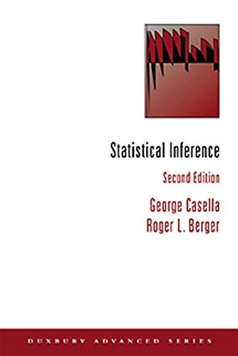

```{r setup, include=FALSE}
knitr::opts_chunk$set(echo = TRUE)
```

# Introducción

La **distribución muestral** de un estadístico depende de la distribución poblacional de la que se toma la muestra aleatoria. 

A continuación se estudian algunas distribuciones muestrales que se basan en una muestra aleatoria extraída de una distribución Normal.

---

**(Teorema.)** Si $X_1,\ldots,X_n$ es una colección de variables aleatorias independientes tales que $X_i\sim\textsf{Normal}(\mu_i,\sigma^2_i)$, para $i=1,\ldots,n$, y $a_1,\ldots, a_n$ es una colección de números reales, entones $\sum_{i=1}^n a_i X_i$ tiene distribución Normal con media $\sum_{i=1}^n a_i\mu_i$ y varianza $\sum_{i=1}^n a_i^2\sigma^2_i$.

*Demostración:*

La función generadora de momentos (fgm) de $Y = \sum_{i=1}^n a_i X_i$ es
$$
\begin{align*}
m_Y(t) &= \textsf{E}\left(\exp{\left[t\,Y\right]}\right) 
= \textsf{E}\left(\exp{\left[t\,\sum_{i=1}^n a_i X_i\right]}\right) 
= \textsf{E}\left(\prod_{i=1}^n\exp{\left[t\, (a_i X_i)\right]}\right) \\
&= \prod_{i=1}^n \textsf{E}\left(\exp{\left[t\, a_i X_i\right]}\right) \qquad\because\,\,\text{Independencia} \\ 
&= \prod_{i=1}^n m_{X_i}(t\,a_i) \qquad\because\,\,\text{Definición de fgm} \\
&= \prod_{i=1}^n \exp{\left[ \mu_i (t\,a_i) + \tfrac12\sigma^2_i(t\,a_i)^2 \right]} \qquad\because\,\,\text{fgm de la Normal} \\
&= \exp{\left[ t\,\left(\sum_{i=1}^n a_i \mu_i\right) + \tfrac12\left(\sum_{i=1}^n a_i^2\sigma^2_i\right)t^2 \right]}
\end{align*}
$$
lo que corresponde a la fgm de una variable aleatoria con distribución Normal con media $\mu_Y = \sum_{i=1}^n a_i \mu_i$ y varianza $\sigma_Y\sum_{i=1}^n a_i^2\sigma^2_i$. Por lo tanto, $Y\sim\textsf{Normal}(\mu_Y, \sigma^2_Y)$. 

---

**(Corolario.)** Si $X_1,\ldots,X_n$ es una muestra aleatoria de una población con distribución Normal con media $\mu$ y varianza $\sigma^2$, entonces $\bar{X}\sim\textsf{Normal}(\mu,\sigma^2/n)$, y por lo tanto, 
$$
\frac{\bar{X} - \mu}{\sigma/\sqrt{n}}\sim\textsf{Normal}(0,1)\,.
$$

*Demostración:* Ejercicio.

---

# Distribución Chi-cuadrado

La distribución **Chi-cuadrado** con $n$ grados de libertad es un caso particular de la **distribución Gamma** con parámetro de forma $\alpha = n/2$ y parámetro de razón $\beta = 1/2$, i.e., $\chi^2_n\equiv \text{Gamma}(n/2,1/2)$.

---

### Ejemplo {-}

Visualizar la función de densidad de probabilidad de una variable aleatoria con distribución $\chi^2_n$, para $n \in\{1,2,3,4,5\}$.

```{r, fig.align='center'}
# Configuración de la visualización
par(mar = c(3, 3, 1.5, 1.5), mgp = c(1.75, 0.75, 0))

# Graficar la distribución Chi-cuadrado para v = 1
curve(dchisq(x, df = 1), from = 0, to = 15, n = 1000, col = 1, ylim = c(0, 0.5),
      xlab = "x", ylab = "f(x)", main = "Distribución Chi-cuadrado", lwd = 2)

# Agregar curvas para v = 2, ..., 5
for (nu in 2:5) {
  curve(dchisq(x, df = nu), from = 0, to = 15, n = 1000, col = nu, add = TRUE, lwd = 2)
}

# Agregar la leyenda
legend("topright", legend = paste0("ν = ", 1:5), col = 1:5, lwd = 2, bty = "n")
```

---

**(Teorema.)** Si $X_1,\ldots,X_n$ es una colección de variables aleatorias independientes tales que $X_i\sim\chi^2_{\nu_i}$, para $i=1,\ldots,n$, entonces $\sum_{i=1}^n X_i$ tiene distribución Chi-cuadrado con $\sum_{i=1}^n \nu_i$ grados de libertad.

*Demostración:* Ejercicio. 

---

**(Teorema.)** Si $X\sim\textsf{Normal}(0,1)$, entonces $X^2\sim\chi^2_1$.

*Demostración:*

La fgm de $Y = X^2$ es
$$
\begin{align*}
m_Y(t) &= \textsf{E}\left(\exp{\left[t\,Y\right]}\right) = \textsf{E}\left(\exp{\left[t\,X^2\right]}\right) \\
&= \int_{-\infty}^\infty e^{t\,x^2}\,\frac{1}{\sqrt{2\pi}}\,e^{-x^2/2}\,\text{d}x = \int_{-\infty}^\infty \frac{1}{\sqrt{2\pi}}\,e^{-x^2(1-2t)/2}\,\text{d}x \\
&= \int_{-\infty}^\infty \frac{1}{\sqrt{1-2t}}\,\frac{1}{\sqrt{2\pi}}\,e^{-u^2/2}\,\text{d}u \qquad\because\,\,u = x\sqrt{1-2t}\,,\,\text{d}u = \sqrt{1-2t}\,\text{d}x\,,\,\text{para}\,\, t < 1/2  \\
&= (1-2t)^{-1/2}\qquad\because\,\, \int_{-\infty}^\infty e^{-u^2/2}\,\text{d}u = \sqrt{2\pi}
\end{align*}
$$
lo que corresponde a la fgm de una variable aleatoria con distribución Chi-cuadrado con 1 grado de libertad. Por lo tanto, $Y\sim\chi^2_1$.

---

**(Teorema.)** Si $X_1,\ldots,X_n$ es una muestra aleatoria de una población con distribución Normal con media $\mu$ y varianza $\sigma^2$, entonces
$$
\sum_{i=1}^n Z_i^2\sim\chi^2_n\,,
$$
donde $Z_i = (X_i-\mu)/\sigma$, para $i=1,\ldots,n$.

*Demostración:* Ejercicio. 

---

**(Teorema.)** Si $X_1,\ldots,X_n$ es una muestra aleatoria de una población con distribución Normal con media $\mu$ y varianza $\sigma^2$, entonces $\bar{X}$ y $S^2$ son independientes.

*Demostración:* Ejercicio. 

Sugerencia: Ver el Teorema 7.3 de Wackerly (2010).

---

**(Teorema.)** Si $X_1,\ldots,X_n$ es una muestra aleatoria de una población con distribución Normal con media $\mu$ y varianza $\sigma^2$, entonces
$$
\frac{(n-1)S^2}{\sigma^2}\sim\chi^2_{n-1}\,.
$$

*Demostración:*

Primero, se observa que 
$$
\begin{align*}
\sum_{i=1}^n (X_i - \mu)^2 &= \sum_{i=1}^n ((X_i - \bar{X}) + (\bar{X} - \mu))^2 \\
&= \sum_{i=1}^n \left((X_i - \bar{X})^2 + 2(X_i - \bar{X})(\bar{X} - \mu) + (\bar{X} - \mu)^2\right) \\
&= (n-1)S^2 + n (\bar{X} - \mu)^2\qquad \because\,\,\sum_{i=1}^n(X_i - \bar{X}) = 0
\end{align*}
$$
y en consecuencia, $V = Y + W$, donde
$$
V = \sum_{i=1}^n \left(\frac{X_i - \mu}{\sigma}\right)^2\,,\qquad Y =\frac{(n-1)S^2}{\sigma^2}\,,\qquad  W = \left(\frac{\bar{X} - \mu}{\sigma/\sqrt{n}}\right)^2\,.
$$

Así, la fgm de $V$ es 
$$
\begin{align*}
m_V(t) &= \textsf{E}\left(\exp{\left[t\,V\right]}\right) \\
&= \textsf{E}\left(\exp{\left[t\,Y\right]}\,\exp{\left[t\,W\right]}\right) \\
&= \textsf{E}\left(\exp{\left[t\,Y\right]}\right)\,\textsf{E}\left(\exp{\left[t\,W\right]}\right)\qquad\because\,\,\bar{X}\,\,\text{y}\,\,S^2\,\,\text{son $\,$independientes} \\
&= m_Y(t)\,m_W(t)\,.
\end{align*}
$$

Como $V\sim\chi^2_n$ y $W\sim\chi^2_1$, entonces se tiene que
$(1-2t)^{-n/2} = m_Y(t)\,(1-2t)^{-1/2}$, para $t < 1/2$, de donde
$$
m_Y(t) = (1-2t)^{-(n-1)/2}\,,
$$
lo que corresponde a la fgm de una variable aleatoria con distribución Chi-cuadrado con $n-1$ grado de libertad. Por lo tanto, $Y\sim\chi^2_{n-1}$.

---

# Distribución $\textsf{t}$

**(Definición.)** Si $Z$ y $V$ son variables aleatorias independientes tales que $Z\sim\textsf{Normal}(0,1)$ y $V\sim\chi^2_n$, entonces se dice que la variable aleatoria
$$
T = \frac{Z}{\sqrt{V/n}}
$$
tiene distribución $\textsf{t}$ Student con $n$ grados de libertad. En este caso, se tiene que
$$
f_T(x) = \frac{1}{\sqrt{\pi\,n}}\,\frac{\Gamma\left( \frac{n+1}{2} \right)}{\Gamma\left( \frac{n}{2} \right)}\,\left( 1 + \frac{x^2}{n} \right)^{-(n+1)/2}\,,\qquad -\infty < x < \infty\,.
$$

Recuerde que dos definiciones populares para $e^x$ son
$$
e^x= \lim_{n\to\infty} \left(1 + \frac{x}{n}\right)^{n}
\qquad\text{y}\qquad
e^x = \sum_{n=0}^\infty \frac{x^n}{n!}\,.
$$

---

### Ejemplo {-}

Visualizar la función de densidad de probabilidad de una variable aleatoria con distribución $\textsf{t}_\nu$, para $\nu\in\{1,2,3,4,5\}$.

```{r, fig.align='center'}
# Visualización de la distribución t-Student con diferentes grados de libertad
par(mar = c(3, 3, 1.5, 1.5), mgp = c(1.75, 0.75, 0))

# Rango de x
x_range <- seq(-5, 5, length.out = 1000)

# Gráfica de la distribución t-Student para v = 1
plot(x_range, dt(x_range, df = 1), type = "l", col = 1, lwd = 2, ylim = c(0, 0.4),
     xlab = "x", ylab = "f(x)", main = "Distribución t-Student")

# Añadir curvas para v = 2, ..., 5
for (nu in 2:5) {
  lines(x_range, dt(x_range, df = nu), col = nu, lwd = 2)
}

# Añadir la distribución normal estándar en gris
lines(x_range, dnorm(x_range), col = "gray", lwd = 3)

# Añadir leyenda
legend("topright", legend = c(paste0("ν = ", 1:5), "Z"),
       col = c(1:5, "gray"), lwd = 2, bty = "n")
```

La distribución Normal estándar proporciona una **"buena aproximación"** (convergencia en distribución) a la distribución $\textsf{t}$ para tamaños de muestra de mayores o iguales a 30. 

---

**(Teorema.)** Si $X_1,\ldots,X_n$ es una muestra aleatoria de una población con distribución Normal con media $\mu$ y varianza $\sigma^2$, entonces
$$
\frac{\bar{X} - \mu}{S/\sqrt{n}}\sim\textsf{t}_{n-1}\,.
$$

*Demostración:*

Como $\bar{X}$ y $S^2$ son independientes, y además,
$$
\frac{\bar{X}-\mu}{\sigma/\sqrt{n}}\sim\textsf{Normal}(0,1)
\qquad\text{y}\qquad
\frac{(n-1)S^2}{\sigma^2}\sim\chi^2_{n-1}\,,
$$
entonces
$$
\begin{align*}
\frac{\frac{\bar{X}-\mu}{\sigma/\sqrt{n}}}{\sqrt{\frac{\frac{(n-1)S^2}{\sigma^2}}{n-1}}}
&= \frac{\bar{X}-\mu}{S/\sqrt{n}}\sim\textsf{t}_{n-1}\,.
\end{align*}
$$

---

# Distribución $\textsf{F}$

**(Definición.)** Si $V$ y $W$ son variables aleatorias independientes tales que $V\sim\chi^2_n$ y $W\sim\chi^2_m$, entonces se dice que la variable aleatoria
$$
F = \frac{V/n}{W/m}
$$
tiene distribución $\textsf{F}$ $n$ grados de libertad en numerador y $m$ grados de libertad en el denominador, i.e., $F\sim\textsf{F}_{n,m}$. En este caso, se tiene que
$$
f_F(x) = \frac{\Gamma\left(\frac{n+m}{2}\right)}{\Gamma\left(\frac{n}{2}\right)\,\Gamma\left(\frac{m}{2}\right)}\,\left(\frac{n}{m}\right)^{n/2}\,x^{n/2 - 1}\,\left(1 + \frac{n}{m}\,x\right)^{-(n+m)/2} \,,\qquad x > 0\,.
$$

---

### Ejemplo {-}

Visualizar la función de densidad de probabilidad de una variable aleatoria con distribución $\textsf{F}_{5,5}$, $\textsf{F}_{5,10}$, $\textsf{F}_{10,5}$ y $\textsf{F}_{10,10}$.

```{r, fig.align='center'}
# Configuración de la visualización
par(mar = c(3, 3, 1.5, 1.5), mgp = c(1.75, 0.75, 0))

# Rango de valores de x
x_range <- seq(0, 6, length.out = 1000)

# Graficar la distribución F con diferentes grados de libertad
plot(x_range, df(x_range, df1 = 5, df2 = 5), type = "l", col = 1, lwd = 2, ylim = c(0, 0.8),
     xlab = "x", ylab = "f(x)", main = "Distribución F")

# Añadir las demás curvas
lines(x_range, df(x_range, df1 = 5, df2 = 10), col = 2, lwd = 2)
lines(x_range, df(x_range, df1 = 10, df2 = 5), col = 3, lwd = 2)
lines(x_range, df(x_range, df1 = 10, df2 = 10), col = 4, lwd = 2)

# Agregar leyenda
legend("topright", 
       legend = c("n = 5, m = 5", "n = 5, m = 10", "n = 10, m = 5", "n = 10, m = 10"),
       col = 1:4, lwd = 2, bty = "n")
```

---

**(Teorema.)** Si $X_1,\ldots,X_n$ y $Y_1,\ldots,Y_m$ son dos muestras aleatorias independientes de poblaciones Normales con medias $\mu_X$ y $\mu_Y$ y varianzas $\sigma^2_X$ y $\sigma^2_Y$, respectivamente, entonces  
$$
\frac{S^2_X/\sigma^2_X}{S^2_Y/\sigma^2_Y}\sim\textsf{F}_{n-1,m-1},
$$
donde $S^2_X$ y $S^2_Y$ son las varianzas muestrales de  $X_1,\ldots,X_n$ y $Y_1,\ldots,Y_m$, respectivamente.

*Demostración:* Ejercicio.

---

# Referencias {-}

```{r, eval = TRUE, echo=FALSE, out.width="25%", fig.pos = 'H', fig.align = 'center'}

```

---

# Ejercicios {-}

- Sea $X_1,\ldots,X_n$ una secuencia de variables aleatorias independientes con funciones generadoras de momentos $m_1(t),\ldots,m_n(t)$, respectivamente. Sea $Y = \sum_{i=1}^n a_i X_i$, donde $a_1, \ldots, a_n$ son constantes. Demuestre que la función generadora de momentos de $U$ es $m_U(t) = \prod_{i=1}^n m_i(a_i \, t)$.

- Sea $X_1,\ldots,X_n$ una muestra aleatoria de variables de Bernoulli con parámetro $\theta \in (0,1)$.

     a. Halle la función generadora de momentos de $X_1$.  
     b. Halle la función generadora de momentos de $Y = X_1 + \cdots + X_n$.  
     c. ¿Cuál es la distribución de $Y$?

- Sean $X_1$ y $X_2$ variables aleatorias i.i.d. provenientes de una población Normal con media $0$ y varianza $\sigma^2$. Defina $Y_1 = X_1 + X_2$ y $Y_2 = X_1 - X_2$. Demuestre que $Y_1$ y $Y_2$ son variables aleatorias independientes tales que $Y_1, Y_2 \sim \textsf{N}(0,\,2\sigma^2)$.

- Sea $X\sim\chi^2_\nu$. Demostrar que $\textsf{E}(X) = \nu$ y $\textsf{Var}(X) = 2\nu$.

- Sea $X\sim\textsf{t}_\nu$. Demostrar que $X^2\sim\textsf{F}_{1,\nu}$, es decir, $\textsf{t}_\nu^2 \equiv \textsf{F}_{1,\nu}$.

- Sea $X\sim\textsf{t}_1$. ¿Cuál es la función de densidad de $X$? ¿Cómo se relaciona esta distribución con la distribución de Cauchy?

- Sea $X\sim\textsf{F}_{n,m}$. Demostrar que $X^{-1}\sim\textsf{F}_{m,n}$, es decir, $\textsf{F}_{n,m}^{-1} \equiv \textsf{F}_{m,n}$.
    
- Sea $X_1,\ldots,X_n$ una muestra aleatoria de tamaño $n$ de una población Normal con media $\mu$ y varianza $\sigma^2$. Demostrar que 
$$
\frac{\bar{X} - \mu}{\sigma/\sqrt{n}}\sim\textsf{N}(0,1)\,,
$$
donde $\bar{X} = \frac{1}{n}\sum_{i=1}^n X_i$. Sugerencia: Demostrar que $\bar{X}\sim\textsf{N}(\mu,\sigma^2/n)$ y que si $X\sim\textsf{N}(\mu,\sigma^2)$, entonces $a X + b\sim\textsf{N}(a\mu+b,a^2\sigma^2)$, donde $a$ y $b$ son constantes, con $a\neq 0$. 

- Sean $X_1,\ldots,X_n$ y $Y_1,\ldots,Y_m$ son dos muestras aleatorias independientes de poblaciones Normales con medias $\mu_X$ y $\mu_Y$ y varianzas $\sigma^2_X$ y $\sigma^2_Y$, respectivamente. Demostrar que 
$$
\frac{\big( \bar{X} - \bar{Y} \big) - (\mu_X - \mu_Y)}{\sqrt{\sigma^2_X/n + \sigma^2_Y/m}}\sim\textsf{N}(0,1)\,,
$$
donde $\bar{X} = \frac{1}{n}\sum_{i=1}^n X_i$ y $\bar{Y} = \frac{1}{m}\sum_{i=1}^m Y_i$.

- Se toman muestras aleatorias independientes de tamaño $n_j$ de cada una de $k$ poblaciones. La población $j$ tiene distribución Normal con media $\mu_j$ y varianza $\sigma^2$, para $j=1,\ldots,k$. Sean $\bar X_j$ y $S_j^2$ la media y la varianza muestral de la muestra aleatoria $j$, respectivamente. 

     a. Sea $\hat\theta = \sum_{j=1}^k c_j\,\bar X_j$ un estimador de $\theta = \sum_{j=1}^k c_j\,\mu_j$, donde $c_1,\ldots,c_k$ son constantes conocidas. Hallar la distribución muestral de $\hat\theta$.
     b. Sea $\mathrm{SCE}=\sum_{j=1}^k (n_j-1)\,S_j^2$. Hallar la distribución muestral de $\mathrm{SCE}/\sigma^2$.
     c. Sea $\mathrm{CME}=\mathrm{SCE}/(n-k)$, donde $n=\sum_{j=1}^k n_j$. Hallar la distribución muestral de
     $$
     T = \frac{\hat\theta - \theta}{\sqrt{\mathrm{CME}\,\sum_{j=1}^k \frac{c_j^2}{n_j}}}\,.
     $$

- Sea $\bar{X}$ el promedio muestral de una muestra aleatoria de tamaño $n=16$ proveniente de una población Normal con media $0$ y varianza $1$. Determinar el valor de $c$ tal que
$$
\textsf{Pr}\left(|\bar{X}| < c\right) = 0.5\,.
$$

- Visualizar la función de distribución acumulada de una variable aleatoria con distribución $\textsf{t}_\nu$, para $\nu\in\{1,2,3,4,5,10,25,50,100\}$. Superponer la función de distribución acumulada de una variable aleatoria con distribución $\textsf{N}(0,1)$.

- Sea $X_1,\ldots,X_n$ una muestra aleatoria de una población $X$ con función de distribución acumulada $F_X(\cdot)$. Demostrar que si $Y = X_{(n)} = \max\{X_1,\ldots,X_n\}$, entonces
$$
F_Y(y) = \big[ F_X(y) \big]^n
\qquad\text{y}\qquad
f_Y(y) = n \, \big[ F_X(y) \big]^{n-1} \, f_X(y)\,.
$$
Sugerencia: Ver Ejemplo 3.5 de González y Jiménez (2025).

- Sea $X_1,\ldots,X_n$ una muestra aleatoria de una población $X$ con función de distribución acumulada $F_X(\cdot)$. Demostrar que si $Y = X_{(1)} = \min\{X_1,\ldots,X_n\}$, entonces
$$
F_Y(y) = 1 - \big[ 1 - F_X(y) \big]^n
\qquad\text{y}\qquad
f_Y(y) = n \, \big[ 1 - F_X(y) \big]^{n-1} \, f_X(y)\,.
$$
Sugerencia: Ver Ejemplo 3.5 de González y Jiménez (2025).

- Sea $X_1,\ldots,X_n$ una muestra aleatoria de una población $X$ con distribución Uniforme en el intervalo $(0,\theta)$, con $\theta > 0$. Hallar la función de densidad de probabilidad y la función de distribución acumulada de $X_{(n)}$.

- Sea $X$ la vida útil (en horas) de un componente electrónico con densidad $f_X(x)=\frac{1}{100}\,e^{-x/100}$, para $x > 0$. Considere dos componentes de este tipo, $X_1$ y $X_2$, independientes e idénticamente distribuidos que operan en serie (el sistema falla cuando cualquiera de los dos falla). Determine la función de densidad de probabilidad de $X_{(1)}$ y calcule el valor esperado de la vida útil del sistema $\textsf{E}(X_{(1)})$.

---