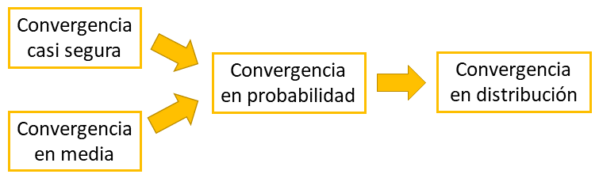

```{r setup, include=FALSE}
knitr::opts_chunk$set(echo = TRUE)
```


# Introducción

Estudiar la **convergencia** de una **sucesión de variables aleatorias** $X_1,X_2,\ldots$ definidas sobre el mismo *espacio de probabilidad* $(\Omega,\mathcal{F},\textsf{P})$ es fundamental para derivar las propiedades de los estadísticos cuando **crece el tamaño de la muestra**.

# Convergencia casi segura

**(Definición.)** Se dice que la sucesión de variables aleatorias $X_1,X_2,\ldots$ **converge casi seguro a $0$**  si se tiene que
$$
\textsf{P}\left(\lim_{n\to\infty} X_n = 0\right) = 1
\qquad\equiv\qquad
\textsf{P}\left( |X_n| < \epsilon\,\,\text{cuando}\,\, n\to\infty \right) = 1\quad\,\,\text{para todo}\,\,\epsilon > 0\,.
$$
Este tipo de convergencia se denota
$$
X_n\xrightarrow{\text{c.s.}} 0\,.
$$

La convergencia casi segura también se denomina **convergencia fuerte**.

**(Definición.)** Se dice que la sucesión de variables aleatorias $X_1,X_2,\ldots$ **converge casi seguro a la variable aleatoria $X$** si la sucesión $X_1-X,X_2-X,\ldots$ converge casi seguro a $0$, lo que se denota 
$$
X_n\xrightarrow{\text{c.s.}} X\,.
$$


### Ejemplo {-}

Sea $X_n\sim\textsf{Bernoulli}(0.5^n)$, para $n=1,2,\ldots$. Demostrar que $X_n\xrightarrow{\text{c.s.}} 0$.

En este caso se tiene que $\textsf{P}(X_n = 0) = 1 - 0.5^n$. Por lo tanto, se tiene que
$$
\textsf{P}\left(\lim_{n\to\infty} X_n = 0\right) = 1
\quad\therefore\quad
X_n\xrightarrow{\text{c.s.}} 0\,,
$$
pues $X_n\sim\textsf{Bernoulli}(0)$ cuando $n\to\infty$.

**(Teorema.)** Sea $X_1,X_2,\ldots$ una secuencia de variables aleatorias. Si para todo $\epsilon > 0$ se tiene que
$$
\sum_{n=1}^\infty \textsf{P}\left( |X_n - X| > \epsilon \right) < \infty \,,
$$
entonces $X_n\xrightarrow{\text{c.s.}} X$.

**(Teorema: Ley fuerte de los grandes números.)** Sea $X_1,X_2,\ldots$ una secuencia de variables aleatorias iid de una población con media $\mu$ y varianza $\sigma^2$. Si $\bar{X}_n = \frac{1}{n}\sum_{i=1}^n X_i$, entonces
$$
\bar{X}_n \xrightarrow{\text{c.s.}} \mu\,.
$$

**(Teorema.)** Sea $X_1,X_2,\ldots$ una secuencia de variables aleatorias iid de una población con media $\mu$ y varianza $\sigma^2$. Si $S^2_n = \frac{1}{n-1}\sum_{i=1}^n (X_i-\bar{X}_n)^2$, entonces
$$
S^2_n \xrightarrow{\text{c.s.}} \sigma^2\,.
$$


# Convergencia en probabilidad

**(Definición.)** Se dice que la sucesión de variables aleatorias $X_1,X_2,\ldots$ **converge en probabilidad a la variable aleatoria $X$** si para todo $\epsilon > 0$ se tiene que

$$
\lim_{n\to\infty} \textsf{P}\left( |X_n - X| < \epsilon \right) = 0
\qquad\equiv\qquad
\textsf{P}\left( |X_n - X| < \epsilon \right) \to 1\quad\text{cuando}\,\,n\to\infty\,.
$$

Este tipo de convergencia se denota
$$
X_n\xrightarrow{\text{p}} X\,.
$$

La convergencia en probabilidad también se denomina se denomina **convergencia débil** o **convergencia estocástica**.

**(Teorema: Ley débil de los grandes números).** Sea $X_1,X_2,\ldots$ una secuencia de variables aleatorias iid de una población con media $\mu$ y varianza $\sigma^2$. Si $\bar{X}_n = \frac{1}{n}\sum_{i=1}^n X_i$, entonces
$$
\bar{X}_n \xrightarrow{\text{p}} \mu\,.
$$

*Demostración:*

La *desigualdad de Chebyschev* señala que si $X$ es una variable aleatoria con media $\mu$ y varianza $\sigma^2$, entonces para todo $\epsilon > 0$ se satisface que 
$$
\textsf{P}(|X - \mu|\geq\epsilon) \leq \frac{\sigma^2}{\epsilon^2}\,.
$$

Aplicando esta desigualdad en este caso, se tiene que
$$
\textsf{P}\left( |\bar{X}_n - \mu| \geq \epsilon \right) \leq \frac{\sigma^2}{n\epsilon^2}\,.
$$
Por lo tanto, si $n\to\infty$, entonces $\textsf{P}\left( |\bar{X}_n - \mu| \geq \epsilon \right) \to 0$, y en consecuencia, $\textsf{P}\left( |\bar{X}_n - \mu| < \epsilon \right) \to 1$, de donde $\bar{X}_n\xrightarrow{\text{p}} 0$.


### Ejemplo {-}

Sea $X_n\sim\textsf{Normal}(0,1/n)$, para $n=1,2,\ldots$. Demostrar que $X_n\xrightarrow{\text{p}} 0$.

Aplicando la desigualdad de Chebyschev se demuestra que el resultado deseado. 

A continuación se ilustra numéricamente el resultado para $\epsilon \in \{0.1,0.2,0.3,0.4,0.5\}$:

```{r, fig.align='center'}
# visualización
par(mar = c(3,3,1.5,1.5), mgp = c(1.75,0.75,0))
N <- 100
plot(x = NA, y = NA, xlim = c(1,N), ylim = c(0,1), xlab = "n", ylab = "Probabilidad", main = "")
for (eps in seq(from = 0.1, to = 0.5, by = 0.1)) {
  P <- NULL
  for (n in 1:N)
    P[n] <- 1- 2*pnorm(q = eps, mean = 0, sd = sqrt(1/n), lower.tail = F)
  lines(x = 1:N, y = P, type = "p", col = 10*eps, pch = 16, cex = 0.5)
}
legend("bottom", legend = seq(from = 0.1, to = 0.5, by = 0.1), col = 1:5, fill = 1:5, border = 1:5, bty = "n", horiz = T)
```


### Ejemplo {-}

Sea $\Omega = [0,1]$, $X(\omega) = \omega$ una variable aleatoria y $X_1,X_2,\ldots$ una sucesión de variables variables aleatorias dada por
$$
\begin{align*}
X_1(\omega) &= \omega + I_{[0/1,1/1]}(\omega) \\
X_2(\omega) &= \omega + I_{[0/2,1/2]}(\omega) \\
X_3(\omega) &= \omega + I_{[1/2,2/2]}(\omega) \\
X_4(\omega) &= \omega + I_{[0/3,1/3]}(\omega) \\
X_5(\omega) &= \omega + I_{[1/3,2/3]}(\omega) \\
X_6(\omega) &= \omega + I_{[2/3,3/3]}(\omega) \\
&\ldots
\end{align*}
$$
donde $\omega\in\Omega$ y $I_A$ es la función indicadora del conjunto $A$. Demostrar que $X_n\xrightarrow{\text{p}} X$, pero $X_n\not\xrightarrow{\text{c.s.}}X$. 

Se observa que cada valor en la sucesión tomará el valor $\omega$ o $\omega+1$ y saltará entre estos dos valores indefinidamente, pero el salto será menos frecuente a medida que $n$ crece.

Para cualquier $\epsilon > 0$, se satisface que
$$
\textsf{P}\left(\omega\in\Omega:|X_n(\omega)-X(\omega)| < \epsilon\right) = \textsf{P}\left(\omega\in\Omega:I_{A_n}(\omega) < \epsilon\right) \to 1\quad\text{cuando}\,\,n\to\infty\,,
$$
dado que la longitud del intervalo del $n$-ésimo término de la sucesión $A_n$ tiende a cero.

Sin embargo, como la sucesión saltará entre $\omega$ o $\omega+1$ indefinidamente, se tiene que
$$
\textsf{P}\left(\omega\in\Omega:I_{A_n}(\omega) < \epsilon\,\,\text{cuando}\,\, n\to\infty \right) < 1\,.
$$


# Convergencia en media 

**(Definición.)** Se dice que la sucesión de variables aleatorias $X_!,X_2,\ldots$ **converge en media $r$-ésima ($r\geq 1$) a la variable aleatoria $X$** si
$$
\lim_{n\to\infty} \textsf{E}\left(|X_n - X|^r\right) = 0\,.
$$

Este tipo de convergencia se denota
$$
X_n\xrightarrow{L_r} X\,.
$$

Si $r = 1$ ($r=2$), entonces se dice que la sucesión converge en **valor esperado** (**meda cuadrática**).


### Ejemplo {-}

Sea $X_n\sim\textsf{Uniforme}(0,1/n)$, para $n=1,2,\ldots$. Demostrar que $X_n\xrightarrow{L_r} 0$, para $r\geq 1$.

En este caso se tiene que
$$
\begin{align*}
\textsf{E}\left(|X_n - 0|^r\right) &= \int_{-\infty}^{\infty} |x-0|^r\,f_{X_n}(x)\,\text{d}x \\
&= \int_0^{\tfrac{1}{n}} x^r\,n\,\text{d}x\qquad\because\,\,f_{X_n}(x) = n\,\,\text{para}\,\,0<x<\tfrac{1}{n} \\
&= n\,\left[\frac{x^{r+1}}{r+1}\right]_{x = 0}^{x = \tfrac{1}{n}} \\
&= \frac{1}{r+1}\,\frac{1}{n^{r}}\to 0\qquad\text{cuando}\,\,n\to\infty\,,\,\,\text{para todo}\,\,r\geq 1\,,
\end{align*}
$$
de donde $X_n\xrightarrow{L_r} 0$.


### Ejercicio {-}

Sea $X_1,_2,\ldots$ una sucesión de variables aleatorias tales que , para $n=1,2,\ldots$. 
$$
X_n = 
\begin{cases}
  n^2 & \text{con probabilidad}\,\,\tfrac{1}{n}\,; \\
  0   & \text{con probabilidad}\,\,1-\tfrac{1}{n}\,.\\
\end{cases}
$$
Demostrar que $X_n\xrightarrow{\text{p}} X$, pero $X_n\not\xrightarrow{L_r}X$ para ningún $r\geq 1$. 


# Convergencia en distribución

**(Definición.)** Se dice que la sucesión de variables aleatorias $X_1,X_2,\ldots$ **converge en distribución a la variable aleatoria $X$** si para todo $x\in\text{C}(F_X)$ se tiene que
$$
F_{X_n}(x)\to F_X(x)\quad\text{cuando}\,\,n\to\infty\,,
$$
donde $F_{X_n}$ y $F_X$ son las funcione de distribución acumuladas de $X_n$ y $X$, respectivamente, y $\text{C}(F_X)=\{x:F_X\,\,\text{es continua en}\,\, x\}$. Este tipo de convergencia se denota 
$$
X_n\xrightarrow{\text{d}} X\,.
$$

### Ejemplo {-}

Sea $X_1,X_2,\ldots$ una sucesión de variables aleatorias tales que
$$
F_{X_n}(x) = 
\begin{cases}
  1 - \left(1 - \frac{1}{n}\right)^{n x}  & \text{si}\,\,x > 0\,; \\
  0                                       & \text{en otro caso}\,,\\
\end{cases}
$$
para $n=2,3,\ldots$, y $X$ una variable aleatoria tal que $X\sim\textsf{Exponencial}(1)$. Demostrar que $X_n\xrightarrow{\text{d}} X$.

En este caso, para todo $x\leq 0$ se tiene que 
$$
F_{X_n}(x) = F_X(x)=0\qquad\text{para}\,\, n = 2,3,\ldots\,.
$$
Ahora, para $x > 0$ se tiene que
$$
\begin{align*}
\lim_{n\to\infty} F_{X_n}(x) &= \lim_{n\to\infty}\left[1- \left(1 - \frac{1}{n}\right)^{n x}\right] \\ 
&= 1- \lim_{m\to\infty}\left(1 - \frac{x}{m}\right)^{m} \qquad\because\,\,m=nx \\
&= 1- e^{-x}\qquad\because\,\,e^x = \lim_{m\to\infty}\left(1 + \frac{x}{m}\right)^{m} \\
&= 1 - F_X(x)
\end{align*}
$$
y por lo tanto $X_n\xrightarrow{\text{d}} X$. A continuación se ilustra visualmente que $X_n\xrightarrow{\text{d}} X$ por medio de las funciones de distribución acumulada:

```{r, fig.align='center'}
Fn <- function(x, n) 1 - (1 - 1/n)^{n*x}
# visualización
par(mar = c(3,3,1.5,1.5), mgp = c(1.75,0.75,0))
curve(expr = pexp(x, rate = 1), n = 1000, col = "blue", lwd = 4, from = 0, to = 4, xlab = "x", ylab = "Distr. Acumulada", main = "")
for (n in 2:30)
  curve(expr = Fn(x, n), n = 1000, add = T)
legend("bottomright", legend = c("Exp(1)",expression(X[n])), col = c("blue","black"), lwd = 2, bty = "n")
```


### Ejemplo {-}

A continuación se ilustra visualmente que $t_n\xrightarrow{\text{d}} Z$ por medio de las funciones de distribución acumulada. Una demostración se puede consultar en Hogg, McKean \& Craig (2018, p. 330):

```{r, fig.align='center'}
# visualización
par(mar = c(3,3,1.5,1.5), mgp = c(1.75,0.75,0))
curve(expr = pnorm(x), n = 1000, col = "blue", lwd = 4, from = -4, to = 4, xlab = "x", ylab = "Distr. Acumulada", main = "")
for (n in 1:30)
  curve(expr = pt(x, df = n), n = 1000, add = T)
abline(v = 0, h = 0.5, col = "lightgray")
legend("bottomright", legend = c("Z",expression(t[n])), col = c("blue","black"), lwd = 2, bty = "n")
```


### Ejemplo {-}

Sea $X_n\sim\textsf{Normal}(0,1/n)$, para $n=1,2,\ldots$. Demostrar que $X_n\xrightarrow{\text{d}} 0$.

En este caso se tiene que
$$
F_{X_n}(x) = \textsf{P}\left(X_n \leq x\right) = \textsf{P}\left(Z \leq \sqrt{n}\,x\right) = \Phi(\sqrt{n}\,x)\,,
$$
donde $Z\sim\textsf{Normal}(0,1)$ y $\Phi$ es la función de distribución acumulada de la distribución Normal estándar. Por lo tanto,
$$
\lim_{n\to\infty} F_{X_n}(x) =
\begin{cases}
  0 & \text{si}\,\,x < 0\,; \\
  1 & \text{si}\,\,x > 0\,. \\
\end{cases}
$$
Así, $X_n\xrightarrow{\text{d}} 0$ dado que $F_{X_n}(x)\to F(x)$ para todo $x\neq 0$, donde $F$ es la función de distribución acumulada de un punto de masa en 0. A continuación se ilustra visualmente que $X_n\xrightarrow{\text{d}} 0$ por medio de las funciones de distribución acumulada:

```{r, fig.align='center'}
# visualización
par(mar = c(3,3,1.5,1.5), mgp = c(1.75,0.75,0))
plot(x = NA, y = NA, xlim = c(-4,4), ylim = c(0,1), xlab = "x", ylab = "Distr. Acumulada", main = "")
for (n in 1:100)
  curve(expr = pnorm(x, mean = 0, sd = 1/sqrt(n)), n = 1000, add = T)
abline(v = 0, h = 0.5, col = "lightgray")
```

Finalmente, se observa que $F_{X_n}(0)=0.5$, para $n=1,2,\ldots$, mientras que $F(0) = 1$, i.e., la convergencia en distribución no se tiene para $x=0$, pero esto no importa porque $F$ no es continua en $x=0$.


### Ejercicio {-}

Sea $X_1,X_2,\ldots$ una sucesión de variables aleatorias tales que $X_n = -X$, para $n=1,2,\ldots$, donde $X\sim\textsf{Normal}(0,1)$. Demostrar que $X_n\xrightarrow{\text{d}} X$, pero $X_n\not\xrightarrow{\text{p}}X$. 

**(Teorema de Lindeberg-Lévy: Teorema del Límite Central.)** Sean $X_1,X_2,\ldots$ es una sucesión de variables aleatorias con media $\mu$ y varianza $\sigma^2$ finitas. Entonces,
$$
\sqrt{n}\,\frac{\bar{X}_n - \mu}{\sigma} \xrightarrow{\text{d}} Z\,,
$$
donde $\bar{X}_n = \frac{1}{n}\sum_{i=1}^n X_n$ $Z\sim\textsf{Normal}(0,1)$.

*Demostración:* Ver Mayorga (2008, pp. 29-30).


### Ejercicio {-}

Sea $X_1,X_2,\ldots$ una sucesión de variables aleatorias independientes tales que $X_i\sim\textsf{Bernoulli}(\pi)$, para $i=1,2,\ldots$. Demostrar que 
$$
\sqrt{n}\,\frac{P_n - \pi}{\sqrt{\pi(1-\pi)}} \xrightarrow{\text{d}} Z\
$$
donde $P_n = \frac{1}{n}\sum_{i=1}^n X_n$ $Z\sim\textsf{Normal}(0,1)$. Empíricamente, ¿qué tan buena es la aproximación para $n = 30$ y $\pi = 0.05$? ¿Y para $n = 30$ y $\pi = 0.50$?


# Propiedades de la convergencia

**(Teorema.)** Sea $X_1,X_2,\ldots$ una sucesión de variables aleatorias y $X$ una variable aleatoria definidas sobre el mismo espacio de probabilidad. Entonces, se tiene que

- Si $X_n\xrightarrow{\text{c.s.}} X$, entonces $X_n\xrightarrow{\text{p}} X$.
- Si $X_n\xrightarrow{L_r} X$,         entonces $X_n\xrightarrow{\text{p}} X$.
- Si $X_n\xrightarrow{\text{p}} X$,    entonces $X_n\xrightarrow{\text{d}} X$.
- Si $X_n\xrightarrow{\text{d}} \text{c}$, entonces $X_n\xrightarrow{\text{p}} \text{c}$.

```{r, eval = TRUE, echo=FALSE, out.width="60%", fig.pos = 'H', fig.align = 'center'}

```

**(Teorema: Teorema de Lévy.)** Sea $X_1,X_2,\ldots$ una sucesión de variables aleatorias y $X$ una variable aleatoria definidas sobre el mismo espacio de probabilidad. Si las funciones generadoras de momentos de $X_1,X_2,\ldots$ existen para todo $t$ en algún intervalo alrededor de 0, entonces se tiene que
$$
X_n\xrightarrow{\text{d}} X\qquad\Longleftrightarrow\qquad m_{X_n}(t)\to m_X(t)\,\,\text{cuando}\,\,n\to\infty\,.
$$


### Ejercicio {-}

Sea $X_1,X_2,\ldots$ una sucesión de variables aleatorias tales que $X_n\sim\chi^2_n$. Demostrar que $X_n/n\xrightarrow{\text{d}} 1$. 

**(Teorema.)** Sean $X_1,X_2,\ldots$ y $Y1_1,Y_2,\ldots$ dos sucesiones de variables aleatorias y $X$ y $Y$ dos variables aleatorias definidas sobre el mismo espacio de probabilidad. Además, sea $f$ una función continua. Entonces, se tiene que

- Si $X_n\xrightarrow{\text{c.s.}} X$, entonces $f(X_n)\xrightarrow{\text{c.s.}} f(X)$.
- Si $X_n\xrightarrow{\text{p}} X$,    entonces $f(X_n)\xrightarrow{\text{p}} f(X)$.
- Si $X_n\xrightarrow{\text{d}} X$,    entonces $f(X_n)\xrightarrow{\text{d}} f(X)$.
- Si $X_n\xrightarrow{\text{c.s.}} X$ y $Y_n\xrightarrow{\text{c.s.}} Y$, entonces $X_n+Y_n\xrightarrow{\text{c.s.}} X+Y$ y $X_n\,Y_n\xrightarrow{\text{c.s.}} X\,Y$.
- Si $X_n\xrightarrow{\text{p}} X$ y $Y_n\xrightarrow{\text{p}} Y$, entonces $X_n+Y_n\xrightarrow{\text{p}} X+Y$ y $X_n\,Y_n\xrightarrow{\text{p}} X\,Y$.

**(Teorema de Slutsky.)** Sean $X_1,X_2,\ldots$ y $Y_1,Y_2,\ldots$ dos sucesiones de variables aleatorias y $X$ y una variables aleatorias definidas sobre el mismo espacio de probabilidad. Además, sea $c$ una constante. Si $X_n\xrightarrow{\text{d}} X$ y $Y_n\xrightarrow{\text{d}} c$, entonces se tiene que

- $X_n + Y_n\xrightarrow{\text{d}} X + c$.
- $X_n\,Y_n\xrightarrow{\text{d}} c\,X$.
- $X_n/Y_n\xrightarrow{\text{d}} X/c$ siempre que $c\neq 0$.

**(Ejercicio.)** Probar que $t_n\xrightarrow{\text{d}} Z$ teniendo en cuenta que $\chi^2_n/n\xrightarrow{\text{d}} 1$.


# Método Delta

Si
$$
\sqrt{n}\,\frac{Y_n-\mu}{\sigma}\xrightarrow{\text{d}}\textsf{Normal}(0,1)
$$
y $g$ es una función diferenciable tal que $g'(\mu)\neq 0$, entonces
$$
\sqrt{n}\,\frac{g(Y_n)-g(\mu)}{|g'(\mu)|\,\sigma}\xrightarrow{\text{d}}\textsf{Normal}(0,1)\,.
$$

### Ejercicio {-}

Sea $X_1,X_2,\ldots$ una sucesión de variables aleatorias iid con media $\mu$ y varianza $\sigma^2$ y $W_n=\exp{(\bar{X}_n)}$, donde $\bar{X}_n = \frac{1}{n}\sum_{i=1}^n X_i$. Demostrar que $W_n\xrightarrow{\text{d}}\textsf{Nornal}\left(e^\mu,e^{2\mu}\sigma^2/n\right)$.


# Referencias {-}

```{r, eval = TRUE, echo=FALSE, out.width="25%", fig.pos = 'H', fig.align = 'center'}
knitr::include_graphics("mayorga.jpg")
```

```{r, eval = TRUE, echo=FALSE, out.width="25%", fig.pos = 'H', fig.align = 'center'}
knitr::include_graphics("ramachandran_tsokos.png")
```

```{r, eval = TRUE, echo=FALSE, out.width="25%", fig.pos = 'H', fig.align = 'center'}
knitr::include_graphics("casella_berger.jpg")
```
