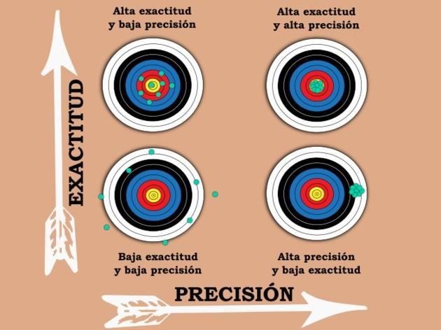

```{r setup, include=FALSE}
knitr::opts_chunk$set(echo = TRUE)
```


# Introducción

Es posible tener disponibles varios estimadores para un mismo parámetro.

¿Qué hace un estimador "mejor" que otro?

Se estudian las **propiedades más relevantes** los estimadores puntuales:

- Insesgamiento.
- Consistencia.
- Suficiencia.
- Variabilidad.


# Insesgamiento

**(Definición).** Sea $X_1,\ldots,X_n$ una muestra aleatoria de una población $X$ con función de densidad (masa) $f_X(x;\theta)$, con $\theta\in\Theta\subset\mathbb{R}$, y $T = T(X_1,\ldots,X_n)$ un estimador de $r(\theta)$. El **error cuadrático medio** (MSE, *mean square error*) de $T$ se define como 
$$
\text{MSE}(T) = \textsf{E}\left( T - r(\theta) \right)^2\,. 
$$

**(Definición).** Sea $X_1,\ldots,X_n$ una muestra aleatoria de una población $X$ con función de densidad (masa) $f_X(x;\theta)$, con $\theta\in\Theta\subset\mathbb{R}$, y $T = T(X_1,\ldots,X_n)$ un estimador de $r(\boldsymbol{\theta})$. Se dice que $T$ es un **estimador insesgado** de $r(\theta)$, si 
$$
\textsf{E}(T) = r(\theta)\,.
$$


```{r, eval = TRUE, echo=FALSE, out.width="75%", fig.pos = 'H', fig.align = 'center'}

```


### Ejercicio {-}

Sea $X_1,\ldots,X_n$ una muestra aleatoria de una población $X$ con media $\mu$ y varianza $\sigma^2$. Demostrar que $\bar{X} = \frac{1}{n}\sum_{i=1} X_i$ y $S^2 = \frac{1}{n-1}\sum_{i=1}^n (X_i - \bar{X})^2$ son estimadores insesgados de $\mu$ y $\sigma^2$, respectivamente.


### Ejercicio {-}

Sea $X_1,\ldots,X_n$ una muestra aleatoria de una población $X$ tal que $f_{X}(x;\theta) = \frac{1}{\theta}\,I_{(0,\theta]} (x)$ y $T = X_{(n)}$ el MLE de $\theta$, donde $X_{(n)} = \max\{X_1,\ldots,X_n\}$. Demostrar que 
$$
\text{MSE}(T) = \frac{2}{(n+1)(n+2)}\,\theta^2\,.
$$
*Sugerencia*: La función de distribución acumulada de $X_{(n)}$ está dada por $(F_X(x))^n$ (Mayorga 2004, p. 19).


**(Definición).** Sea $X_1,\ldots,X_n$ una muestra aleatoria de una población $X$ con función de densidad (masa) $f_X(x;\theta)$, con $\theta\in\Theta\subset\mathbb{R}$, y $T = T(X_1,\ldots,X_n)$ un estimador de $r(\theta)$. El **sesgo del estimador** $T$ se define como
$$
\text{B}(T) = \textsf{E}(T) - r(\theta)\,.
$$


### Ejercicio {-}

Demostrar que para un estimador $T$ de $r(\boldsymbol{\theta})$ se tiene que
$$
\text{ECM}(T) = \textsf{Var}(T) + \text{B}(T)^2\,.
$$
*Sugerencia*: $\textsf{E}\left( T - r(\theta) \right)^2 = \textsf{E}\left( T - \textsf{E}(T) + \textsf{E}(T) - r(\theta) \right)^2$.


### Ejercicio {-}

Demostrar que si $T$ es un estimador insesgado de $r(\boldsymbol{\theta})$, entonces
$$
\text{ECM}(T) = \textsf{Var}(T)\,.
$$


### Ejercicio {-}

Sea $X_1,X_2,X_3$ una muestra aleatoria de una población $X$ con media $\mu$ y varianza $\sigma^2$. Demostrar que $T_1 = \bar{X}$ y $T_2 = (2X_1 + X_2 + 5X_3)/8$ son estimadores insesgados de $\mu$. ¿Cuál de los dos estimadores tiene menor MSE?


### Ejercicio {-}

Sean $T_1$ y $T_2$ dos estimadores insesgados de un parámetros $\theta$. Demostrar que la combinación convexa
$$
T = a\,T_1 + (1-a)\,T_2\,,\qquad\text{con}\,\, 0 < a < 1\,,
$$
es un estimador insesgado de $\theta$. Además, asumiendo que $T_1$ y $T_2$ son independientes, ¿cuál debería ser el valor de $a$ para minimizar la varianza de $T$? *Sugerencia*: Considerar la varianza de $T$ como función de $a$. 


**(Definición).** Sea $X_1,\ldots,X_n$ una muestra aleatoria de una población $X$ con función de densidad (masa) $f_X(x;\theta)$, con $\theta\in\Theta\subset\mathbb{R}$, y $T = T(X_1,\ldots,X_n)$ un estimador de $r(\theta)$. Se dice que $T$ es un **estimador asintóticamente insesgado** de $r(\theta)$ si 
$$
\lim_{n\to\infty}\text{B}(T) = 0\,.
$$


### Ejercicio {-}

Sea $X_1,\ldots,X_n$ una muestra aleatoria de una población Normal con media $\mu$ y varianza $\sigma^2$. Demostrar que el MLE de $\sigma^2$ es un estimador asintóticamente insesgado de $\sigma^2$.


# Consistencia

**(Definición).** Sea $X_1,\ldots,X_n$ una muestra aleatoria de una población $X$ con función de densidad (masa) $f_X(x;\theta)$, con $\theta\in\Theta\subset\mathbb{R}$, y $T = T(X_1,\ldots,X_n)$ un estimador de $r(\theta)$. Se dice que $T$ es un **estimador consistente en error cuadrático medio** de $r(\theta)$, si
$$
\lim_{n\to\infty} \textsf{E} \left( T - r(\theta) \right)^2 = 0\,,
$$
i.e., si la sucesión $T_1,T_2,\ldots$ converge en media cuadrática a $r(\theta)$.

**(Definición).** Sea $X_1,\ldots,X_n$ una muestra aleatoria de una población $X$ con función de densidad (masa) $f_X(x;\theta)$, con $\theta\in\Theta\subset\mathbb{R}$, y $T = T(X_1,\ldots,X_n)$ un estimador de $r(\theta)$. Se dice que $T$ es un **estimador consistente** de $r(\theta)$, si para todo $\epsilon > 0$ se tiene que
$$
\lim_{n\to\infty} \textsf{P} \left( | T - r(\theta)| < \epsilon  \right) = 1\,,
$$
i.e., si la sucesión $T_1,T_2,\ldots$ converge en probabilidad a $r(\theta)$.


### Ejercicio {-}

Sea $X_1,\ldots,X_n$ una muestra aleatoria de una población $X$ con media $\mu$ y varianza $\sigma^2$. Demostrar que $\bar{X} = \frac{1}{n}\sum_{i=1} X_i$ es un estimador consistente de $\mu$. *Sugerencia*: Utilizar la desigualdad de Chebychev.


**(Teorema).** Si $T$ un estimador de $\theta\in\Theta\subset\mathbb{R}$ tal que
$$
\lim_{n\to\infty} \text{MSE}(T) = 0\,,
$$
entonces $T$ es un estimador consistente de $\theta$.

*Demostración:*

Dado $\epsilon > 0$ se tiene que
$$
\begin{align*}
\textsf{P}\left(|T - \theta| \geq \epsilon\right) 
& =  \textsf{P}(|n - \theta|^2 \geq \epsilon^2) \\
&\leq \frac{\textsf{E}\left(T - \theta\right)^2}{\epsilon^2} \qquad\because\,\,\text{Desigualdad de Markok} \\
&= \frac{\text{MSE}(T)}{\epsilon^2}\rightarrow 0\,\,\text{cuando}\,\,n\to\infty\,. 
\end{align*}
$$
Por lo tanto, $T$ es un estimador consistente de $\theta$.

**(Corolario).** Si $T$ es un estimador insesgado de $\theta\in\Theta\subset\mathbb{R}$ tal que
$$
\lim_{n\to\infty} \textsf{Var}(T) = 0\,,
$$
entonces $T$ es un estimador consistente de $\theta$.

*Demostración:* Ejercicio.

# Suficiencia 

¿La realización de un estadístico puede reemplazar todos los datos de la muestra sin perdida de información?

Un estadístico es **suficiente** para un parámetro $\theta$ si el estadístico contiene toda la información disponible en la muestra aleatoria acerca de $\theta$.

**(Definición).** Sea $X_1,\ldots,X_n$ una muestra aleatoria de una población $X$ con función de densidad (masa) $f_X(x;\boldsymbol{\theta})$, con $\boldsymbol{\theta}\in\Theta\subset\mathbb{R}^k$, y $T = T(X_1,\ldots,X_n)$ un estimador de $\boldsymbol{\theta}$. Se dice que $T$ es un **estimador suficiente** para $\boldsymbol{\theta}$, si la distribución condicional de $\boldsymbol{X} = (X_1,\ldots,X_n)$ dado $T$ no depende de $\boldsymbol{\theta}$.


### Ejemplo {-}

Sea $X_1,\ldots,X_n$ una muestra aleatoria de una población Bernoulli con parámetro $\theta$. Demostrar que $T = \sum_{i=1}^n X_i$ es un estadístico suficiente para $\theta$.

Como $X_i\stackrel{\text{iid}}{\sim}\textsf{Bernoulli}(\theta)$, para $i=1,\ldots,n$, entonces $T=\sum_{i=1}^n X_i \sim\textsf{Binomial}(n,\theta)$. Así, la distribución condicional de $\boldsymbol{X} = (X_1,\ldots,X_n)$ dado $T = t$ está dada por
$$
f_{\boldsymbol{X}}(x_1,\ldots,x_n\mid T=t) 
= \frac{f_{\boldsymbol{X},T}(x_1,\ldots,x_n,t)}{f_T(t)} 
= \frac{\theta^{t}(1-\theta)^{n-t}}{\binom{n}{t}\theta^{t}(1-\theta)^{n-t}}
= \frac{1}{\binom{n}{t}}
\qquad\text{para}\,\, t = \textstyle\sum_{i=1}^n x_i\,,
$$
la cual no depende de $\theta$. Por lo tanto $T$ es un estadístico suficiente para $\theta$.


### Ejercicio {-}

Sea $X_1,\ldots,X_n$ una muestra aleatoria de una población $X$ tal que $f_X(x;\theta) = \frac{1}{\theta}\,I_{(0,\theta]}(x)$. Demostrar que $T = X_{(n)}$, donde $X_{(n)} = \max\{X_1,\ldots,X_n\}$, es un estadístico suficiente para $\theta$. *Sugerencia*: La función de distribución acumulada de $X_{n}$ está dada por $(F_X(x))^n$ (Mayorga 2004, p. 19).


**(Teorema: Criterio de factorización de Fisher-Neyman).**  Sea $X_1,\ldots,X_n$ una muestra aleatoria de una población $X$ con función de densidad (masa) $f_X(x;\boldsymbol{\theta})$, con $\boldsymbol{\theta}\in\Theta\subset\mathbb{R}^k$, y $T = T(X_1,\ldots,X_n)$ un estimador de $\boldsymbol{\theta}$. Se tiene que $T$ es un **estadístico suficiente** para $\boldsymbol{\theta}$ si y solo si 
$$
L(\boldsymbol{\theta}) = g(T(x_1,\ldots,x_n);\boldsymbol{\theta})\cdot h(x_1,\ldots,x_n)\,,
$$
donde $g$ es una función no negativa que depende de $\boldsymbol{\theta}$ y de $x_1,\ldots,x_n$ a través de $T = T(x_1,\ldots,x_n)$, y $h$ es una función no negativa que solo depende de $x_1,\ldots,x_n$.

*Demostración:* Ver Mayorga (2004, pp. 99-100).


### Ejemplo {-}

Sea $X_1,\ldots,X_n$ una muestra aleatoria de una población Bernoulli con parámetro $\theta$. Demostrar por medio del criterio de factorización de Fisher-Neyman que $T = \sum_{i=1}^n X_i$ es un estadístico suficiente para $\theta$.


### Ejercicio {-}

Sea $X_1,\ldots,X_n$ una muestra aleatoria de una población $X$ tal que $f_X(x;\theta) = \frac{1}{\theta}\,I_{(0,\theta]}(x)$. Demostrar por medio del criterio de factorización de Fisher-Neyman que $T = X_{(n)}$, donde $X_{(n)} = \max\{X_1,\ldots,X_n\}$, es un estadístico suficiente para $\theta$.


### Ejemplo {-}

Sea $X_1,\ldots,X_n$ una muestra aleatoria de una población Normal media $\mu$ y varianza $\sigma^2$. Demostrar por medio del criterio de factorización de Fisher-Neyman que $T = \left(\sum_{i=1}^n X_i,\sum_{i=1}^n X_i^2\right)$ es un estadístico suficiente para $(\theta,\sigma^2)$.


**(Teorema).** Sea $X_1,\ldots,X_n$ una muestra aleatoria de una población $X$ con función de densidad (masa) $f_X(x;\boldsymbol{\theta})$, con $\boldsymbol{\theta}\in\Theta\subset\mathbb{R}^k$, y $T = T(X_1,\ldots,X_n)$ un estadístico suficiente para $\boldsymbol{\theta}$. Si $\hat{\boldsymbol{\theta}}_{\text{MLE}}$ existe y es único, entonces $\hat{\boldsymbol{\theta}}_{\text{MLE}}$ es función de $T$.

*Demostración*:

Como $T$ es un estadístico suficiente para $\boldsymbol{\theta}$, en virtud del criterio de factorización de Fisher-Neyman se tiene que
$$
L(\boldsymbol{\theta}) = g(T(x_1,\ldots,x_n);\boldsymbol{\theta})\cdot h(x_1,\ldots,x_n)\,.
$$
Además, como $\hat{\boldsymbol{\theta}}_{\text{MLE}}$ existe y es único, entonces $\hat{\boldsymbol{\theta}}_{\text{MLE}}$ maximiza a $L$, y en consecuencia, $\hat{\boldsymbol{\theta}}_{\text{MLE}}$ también debe maximizar a $g$, dado que $h$ es constante respecto a $\boldsymbol{\theta}$. Por lo tanto, $\hat{\boldsymbol{\theta}}_{\text{MLE}}$ es función de $T$.


**(Definición).** Una función de densidad (masa) $f_X(x;\theta)$, con $\theta\in\Theta\subset\mathbb{R}$, pertenece a la **familia exponencial de densidades** si se puede expresar como
$$
f_X(x;\theta) = a(\theta)\,b(x)\,\exp{\left( c(\theta)\,d(x) \right)}\,,
$$
donde $a$, $b$, $c$ y $d$ son funciones elegidas convenientemente.


### Ejemplo {-}

Demostrar que la familia de distribuciones Poisson pertenece a la familia exponencial de densidades.

Si $X\sim\text{Poisson}(\theta)$, entonces
$$
f_X(x;\theta) = \frac{e^{-\theta}\,\theta^x}{x!}\,I_{\{0,1,\ldots\}}(x) = a(\theta)\,b(x)\,\exp{\left( c(\theta)\,d(x) \right)}\,,
$$
donde
$$
a(\theta) = e^{-\theta}\,,\qquad 
b(x) = \frac{1}{x!}\,I_{\{0,1,\ldots\}}(x)\,,\qquad 
c(\theta) = \log\theta\,,\qquad
d(x) = x\,.
$$
Por lo tanto, la familia de distribuciones Poisson pertenece a la familia exponencial de densidades.


### Ejercicio {-}

Demostrar que las familias de distribuciones Binomial, Binomial Negativa y Exponencial pertenecen a la familia exponencial de densidades.


**(Definición).** Una función de densidad (masa) $f_X(x;\boldsymbol{\theta})$, con $\boldsymbol{\theta}\in\Theta\subset\mathbb{R}^k$, pertenece a la **familia exponencial de densidades $k$-paramétrica** si se puede expresar como
$$
f_X(x;\boldsymbol{\theta}) = a(\boldsymbol{\theta})\,b(x)\,\exp{\left(\textstyle\sum_{j=1}^k c_j(\boldsymbol{\theta})\,d_j(x) \right)}\,,
$$
donde $a$, $b$, $c_j$ y $d_j$ son funciones elegidas convenientemente.


### Ejemplo {-}

Demostrar que la familia de distribuciones Normal pertenece a la familia exponencial de densidades 2-paramétrica.

Si $X\sim\text{Normal}(\mu,\sigma^2)$, entonces
$$
f_X(x;\boldsymbol{\theta}) 
= \frac{1}{\sqrt{2\pi\sigma^2}}\,\exp{\left( -\tfrac{1}{2\sigma^2} (x - \mu)^2 \right)}\,I_{(-\infty,\infty)}(x)
=a(\boldsymbol{\theta})\,b(x)\,\exp{\left( c_1(\boldsymbol{\theta})\,d_1(x) + c_2(\boldsymbol{\theta})\,d_2(x) \right)}\,,
$$
donde
$$
a(\boldsymbol{\theta}) = (\sigma^2)^{-1/2}\,\exp{\left( -\tfrac{\mu^2}{2\sigma^2} \right)}\,,
b(x) = (2\pi)^{-1/2}\,I_{(-\infty,\infty)}(x)\,,
c_1(\boldsymbol{\theta}) = \tfrac{\mu}{\sigma^2}\,,
d_1(x) = x\,,
c_2(\boldsymbol{\theta}) = - \tfrac{1}{2\sigma^2}\,,
d_2(x) = x^2\,.
$$
Por lo tanto, la familia de distribuciones Normal pertenece a la familia exponencial de densidades 2-paramétrica.


### Ejercicio {-}

Demostrar que las familias de distribuciones Beta, Gamma, Log-Normal e Inversa Gaussiana pertenecen a la familia exponencial de densidades $k$-paramétrica.


**(Propiedad).** Si $X_1,\ldots,X_n$ una muestra aleatoria de una población $X$ cuya función de densidad (masa) $f_X(x;\theta)$, con $\boldsymbol{\theta}\in\Theta\subset\mathbb{R}$, pertenece a la familia exponencial, entonces
$$
T = \sum_{i=1}^n d(X_i)
$$
es un estadístico suficiente para $\theta$. En este caso, $\eta = c(\theta)$ y $T = \sum_{i=1}^n d(X_i)$ se denominan **parámetro natural** y **estadístico natural** de la familia exponencial.

*Demostración*: Ejercicio.

Análogamente, $\boldsymbol{\eta} = c(\boldsymbol{\theta})$ y $T = \left( \sum_{i=1}^n d_1(x_i),\ldots,\sum_{i=1}^n d_k(x_i) \right)$ se denominan **parámetro natural** y **estadístico natural** de la familia exponencial $k$-paramétrica. 

**(Definición).** Sea $X_1,\ldots,X_n$ una muestra aleatoria de una población $X$ con función de densidad (masa) $f_X(x;\boldsymbol{\theta})$, con $\boldsymbol{\theta}\in\Theta\subset\mathbb{R}^k$. Se dice que los estadísticos $T_1 = T_1(X_1,\ldots,X_n)$ y $T_2 = T_2(X_1,\ldots,X_n)$ son **estadísticos equivalentes** si existe una función uno a uno (inyectiva) $g$ tal que $T_1 = g(T_2)$.

**(Teorema).** Sea $X_1,\ldots,X_n$ una muestra aleatoria de una población $X$ con función de densidad (masa) $f_X(x;\boldsymbol{\theta})$, con $\boldsymbol{\theta}\in\Theta\subset\mathbb{R}^k$, y $T_1 = T_1(X_1,\ldots,X_n)$ y $T_2 = T_2(X_1,\ldots,X_n)$ dos estadísticos equivalentes. Si $T_1$ es un estadístico suficiente para $\boldsymbol{\theta}$, entonces $T_2$ también es un estadístico suficiente para $\boldsymbol{\theta}$.

*Demostración*: Ejercicio.


# Variabilidad

**(Definición).** Sea $X_1,\ldots,X_n$ una muestra aleatoria de una población $X$ con función de densidad (masa) $f_X(x;\theta)$, con $\theta\in\Theta\subset\mathbb{R}$, y $T = T(X_1,\ldots,X_n)$ y $U = U(X_1,\ldots,X_n)$ dos estadísticos insesgados de $\theta$. Se dice que $T$ es **uniformemente mejor** que $U$ si $\textsf{Var}(T) \leq \textsf{Var}(U)$, para todo $\theta\in\Theta$.

**(Definición).** Sea $X_1,\ldots,X_n$ una muestra aleatoria de una población $X$ con función de densidad (masa) $f_X(x;\theta)$, con $\theta\in\Theta\subset\mathbb{R}$, y $T = T(X_1,\ldots,X_n)$ un estimador de $r(\theta)$. Se dice que $T$ es un **estimador insesgado de varianza uniformemente mínima** (UMVUE, *uniformly minimum variance unbiased estimator*) de $r(\theta)$, si $T$ es un estimador insesgado de $r(\theta)$ y $\textsf{Var}(T) \leq \textsf{Var}(U)$ para cualquier otro estimador insesgado $U = U(X_1,\ldots,X_n)$ de $r(\theta)$.

**(Teorema: Teorema de Rao-Blackwell).** Sea $X_1,\ldots,X_n$ una muestra aleatoria de una población $X$ con función de densidad (masa) $f_X(x;\theta)$, con $\theta\in\Theta\subset\mathbb{R}$, y $T = T(X_1,\ldots,X_n)$ un estadístico suficiente para $\theta$. Si $U$ es un estimador insesgado de $r(\theta)$ y $T_{\text{RB}} = \textsf{E}(U\mid T)$, entonces:

a. $T_{\text{RB}}$ es función de $T$ y no depende de $\theta$.
b. $\textsf{E}(T_{\text{RB}}) = r(\theta)$.
c. $\textsf{Var}(T_{\text{RB}}) \leq \textsf{Var}(U)$.

*Demostración*:

a. Como $T$ es un estadístico suficiente para $\theta$, entonces por definición la distribución condicional de $U\mid T$ no depende de $\theta$. Por lo tanto, $\textsf{E}(U\mid T)$ depende exclusivamente de $T$ y no de $\theta$.
b. El valor esperado de $T_{\text{RB}}$ está dado por
$$
\begin{align*}
\textsf{E}(T_{\text{RB}}) &= \textsf{E}\left( \textsf{E}(U\mid T) \right)\qquad\because\,\,\text{Definición de}\,\,T_{\text{RB}} \\
&= \textsf{E}\left( U \right)\qquad\because\,\, \textsf{E}(X) = \textsf{E}\left( \textsf{E}(X\mid Y) \right) \\
&= r(\theta)\,.
\end{align*}
$$
Por lo tanto, $T_{\text{RB}}$ es un estimador insesgado de $r(\theta)$.

c. Por la ley de la varianza total, se tiene que la varianza de $U$ es 
$$
\begin{align*}
\textsf{Var}(U) &= \textsf{E}\left( \textsf{Var} (U\mid T) \right) + \textsf{Var}\left( \textsf{E} (U\mid T) \right) \\
&= \textsf{E}\left( \textsf{Var} (U\mid T) \right) + \textsf{Var}\left( T_{\text{RB}} \right) \qquad\because\,\,\text{Definición de}\,\,T_{\text{RB}}\,.
\end{align*}
$$
Como $\textsf{Var} (U\mid T) \geq 0$ para todo $T$, entonces $\textsf{E}\left( \textsf{Var} (U\mid T) \right) \geq 0$. Por lo tanto, $\textsf{Var}(T_{\text{RB}}) \leq \textsf{Var}(U)$.


**(Definición).** Sea $X$ una variable aleatoria con función de densidad (masa) $f_X(x;\theta)$ tal que $\frac{\partial}{\partial\theta}\log f_X(x;\theta)$ existe para todo $x\in\mathfrak{X}$ y para todo $\theta\in\Theta\subset\mathbb{R}$. Se denomina **función de puntuación** (*score function*) a la función
$$
s(X;\theta) = \frac{\partial}{\partial\theta}\log f_X(X;\theta)\,.
$$
Además, la **información esperada de Fisher** acerca de $\theta$ en la variable aleatoria $X$ se define como:
$$
I = I(\theta) = \textsf{Var}\left( s(X;\theta) \right) = \textsf{Var}\left( \frac{\partial}{\partial\theta}\log f_X(X;\theta) \right) \,.
$$

**(Propiedad).** Sea $X$ una variable aleatoria con función de densidad (masa) $f_X(x;\theta)$ tal que $\frac{\partial}{\partial\theta}\log f_X(x;\theta)$ existe para todo $x\in\mathfrak{X}$ y para todo $\theta\in\Theta\subset\mathbb{R}$. El valor esperado de la función de puntaje es 0:
$$
\textsf{E}\left( s(X;\theta) \right) = \textsf{E}\left( \frac{\partial}{\partial\theta}\log f_X(X;\theta) \right) = 0.
$$

*Demostración*:

Se tiene que 
$$
\begin{align*}
\textsf{E}\left( s(X;\theta) \right) &= \textsf{E}\left( \frac{\partial}{\partial\theta}\log f_X(X;\theta) \right) \\
&= \int_{\mathfrak{X}} \left( \frac{\partial}{\partial\theta}\log f_X(x;\theta) \right) f_X(x;\theta)\,\text{d}x \\
&= \int_{\mathfrak{X}} \frac{\frac{\partial}{\partial\theta}f_X(x;\theta)}{f_X(x;\theta)} f_X(x;\theta)\,\text{d}x \\
&= \int_{\mathfrak{X}} \frac{\partial}{\partial\theta}f_X(x;\theta)  \,\text{d}x \\
&= \frac{\text{d}}{\text{d}\theta} \int_{\mathfrak{X}} f_X(x;\theta)  \,\text{d}x\qquad\because\,\,\text{Regla de Leibniz} \\
&= \frac{\text{d}}{\text{d}\theta}\, (1) \\
&= 0\,.
\end{align*}
$$

Como $\textsf{E}(s(X;\theta)) = 0$, entonces $\textsf{Var}(s(X;\theta)) = \textsf{E}(s(X;\theta)^2)$, y en consecuencia, la **información esperada de Fisher** acerca de $\theta$ en la variable aleatoria $X$ equivale a 
$$
I = \textsf{E}\left(\frac{\partial}{\partial\theta}\log f_X(X;\theta)\right)^2 \,.
$$

**(Propiedad).** Sea $X$ una variable aleatoria con función de densidad (masa) $f_X(x;\theta)$ tal que $\log f_X(x;\theta)$ es doblemente diferenciable respecto a $\theta$ para todo $x\in\mathfrak{X}$ y para todo $\theta\in\Theta\subset\mathbb{R}$. Entonces, la **información esperada de Fisher** acerca de $\theta$ en la variable aleatoria $X$ equivale a 
$$
I = -\textsf{E}\left(\frac{\partial^2}{\partial\theta^2}\log f_X(X;\theta)\right) \,.
$$

*Demostración*: Ejercicio.


### Ejercicio {-}

Sea $X\sim\textsf{Bernoulli}(\theta)$. Demostrar que $I = \frac{1}{\theta(1-\theta)}$.


### Ejercicio {-}

Sea $X\sim\textsf{Poisson}(\theta)$. Demostrar que $I = \frac{1}{\theta}$.


### Ejercicio {-}

Sea $X\sim\textsf{Normal}(\mu,\sigma^2)$, con $\sigma^2$ conocido. Demostrar que $I(\mu) = \frac{1}{\sigma^2}$.


**(Definición).** Sea $X_1,\ldots,X_n$ una muestra aleatoria de una población $X$ con función de densidad (masa) $f_X(x;\theta)$ tal que $\frac{\partial}{\partial\theta}\log f_X(x;\theta)$ existe para todo $x\in\mathfrak{X}$ y para todo $\theta\in\Theta\subset\mathbb{R}$. La **información esperada de Fisher** acerca de $\theta$ en la muestra aleatoria $X_1,\ldots,X_n$ se define como:
$$
I_n = I_n(\theta) = \textsf{Var}\left( \sum_{i=1}^n s(X_i;\theta) \right) = \sum_{i=1}^n \textsf{Var}\left( s(X_i;\theta) \right) \,.
$$
**(Propiedad).** Sea $X_1,\ldots,X_n$ una muestra aleatoria de una población $X$ con función de densidad (masa) $f_X(x;\theta)$ tal que $\log f_X(x;\theta)$ es doblemente diferenciable respecto a $\theta$ para todo $x\in\mathfrak{X}$ y para todo $\theta\in\Theta\subset\mathbb{R}$. Entonces, la **información esperada de Fisher** acerca de $\theta$ en la muestra aleatoria $X_1,\ldots,X_n$ equivale a 
$$
I_n
=  \textsf{E}\left(\frac{\partial}{\partial\theta}\log \prod_{i=1}^n f_X(X_i;\theta)\right)^2        
= -\textsf{E}\left(\frac{\partial^2}{\partial\theta^2}\log \prod_{i=1}^n f_X(X_i;\theta)\right) = nI \,.
$$

*Demostración*: Ejercicio.


**(Definición).** Sea $X_1,\ldots,X_n$ una muestra aleatoria de una población $X$ con función de densidad (masa) $f_X(x;\theta)$, con $\theta\in\Theta\subset\mathbb{R}$, y $T=T(X_1,\ldots,X_n)$ un estadístico. Se dice que el modelo de la población satisface las **condiciones de regularidad** si:

- $\frac{\partial}{\partial\theta}\log f_X(x;\theta)$ existe para todo $x\in\mathfrak{X}$ y para todo $\theta\in\Theta$.
- $I < \infty$ para todo $\theta\in\Theta$.
- Si $X$ es continua
$$
\int_{\mathfrak{X}}\ldots\int_{\mathfrak{X}} \frac{\partial}{\partial\theta}\prod_{i=1}^n f_X(x_i;\theta)\,\text{d}x_1\ldots\text{d}x_n = \frac{\text{d}}{\text{d}\theta} \int_{\mathfrak{X}}\ldots\int_{\mathfrak{X}} \prod_{i=1}^n f_X(x_i;\theta)\,\text{d}x_1\ldots\text{d}x_n\,.
$$
- Si $X$ es continua
$$
\int_{\mathfrak{X}}\ldots\int_{\mathfrak{X}} t(x_1,\ldots,x_n) \, \frac{\partial}{\partial\theta}\prod_{i=1}^n f_X(x_i;\theta)\,\text{d}x_1\ldots\text{d}x_n 
= \frac{\text{d}}{\text{d}\theta} \int_{\mathfrak{X}}\ldots\int_{\mathfrak{X}} t(x_1,\ldots,x_n) \prod_{i=1}^n f_X(x_i;\theta)\,\text{d}x_1\ldots\text{d}x_n\,.
$$

**(Teorema: Desigualdad de Cramér-Rao).** Sea $X_1,\ldots,X_n$ una muestra aleatoria de una población $X$ con función de densidad (masa) $f_X(x;\theta)$, con $\theta\in\Theta\subset\mathbb{R}$, y $T=T(X_1,\ldots,X_n)$ un estimador de $r(\theta)$. Si se satisfacen las condiciones de regularidad se tiene que
$$
\textsf{E}\left(T - r(\theta)\right)^2 \geq \frac{\left(r'(\theta) + \text{B}'\right)^2}{I_n}\,,
$$
donde $\text{B} = \text{B}(T) = \textsf{E}(T) - r(\theta)$ es el sesgo de $T$ respecto a $r(\theta)$ y $\text{B}' = \frac{\partial}{\partial\theta}\text{B}$.

*Demostración:* Ver Mayorga (2004, pp. 103-104).

Si $T$ es un estimador insesgado de $r(\theta)=\theta$, entonces la desigualdad de Cramér-Rao se convierte en
$$
\textsf{Var}\left(T\right) \geq \frac{1}{I_n}\,.
$$
El lado derecho de esta expresión se conoce como **cota inferior de Cramér-Rao** (CRLB, *Cramér–Rao lower bound*).

La CRLB se puede utilizar para **comprobar si un estimador insesgado es un UMVUE**: Si la varianza de un estimador particular es igual a la CRLB, entonces ningún otro estimador puede tener una varianza menor, lo que implica que el estimador debe ser un UMVUE.


**(Teorema: Normalidad asintótica del MLE).** Bajo la condiciones de regularidad, se tiene que
$$
\hat{\theta}_{\text{MLE}} \xrightarrow{\text{d}} \textsf{Normal}\left(\theta,I_n^{-1}\right)
\qquad\text{y}\qquad
\hat{\theta}_{\text{MLE}} \xrightarrow{\text{d}} \textsf{Normal}\left(\theta,\hat{I}_n^{-1}\right)\,,
$$
donde $\hat{I}_n = I_n(\hat{\theta}_{\text{MLE}})$ es la **información observada de Fisher**.


### Ejercicio {-}

Sea $X_1,\ldots,X_n$ una muestra aleatoria de una población Bernoulli con parámetro $\theta$. Demostrar que
$$
\frac{\bar{X}-\theta}{\sqrt{\frac{\theta(1-\theta)}{n}}}\xrightarrow{\text{d}}\textsf{Normal}(0,1)\,,
$$
donde $\bar{X} = \frac{1}{n}\sum_{i=1}^n X_i$.


### Ejercicio {-}

Sea $X_1,\ldots,X_n$ una muestra aleatoria de una población Poisson con parámetro $\theta$. Demostrar que
$$
\frac{\bar{X}-\theta}{\sqrt{\frac{\theta}{n}}}\xrightarrow{\text{d}}\textsf{Normal}(0,1)\,,
$$
donde $\bar{X} = \frac{1}{n}\sum_{i=1}^n X_i$.


**(Teorema: Método Delta).** Bajo la condiciones de regularidad, si $\hat\theta = \hat{\theta}_{\text{MLE}}$ es el MLE de $\theta$ y $\tau = g(\theta)$, donde $g$ es una función diferenciable tal que $g'(\mu)\neq 0$, entonces
$$
\frac{\hat{\tau} - \tau}{|g'(\theta)|\,I_n^{-1/2}} \xrightarrow{\text{d}} \textsf{Normal}\left(0,1\right)
\qquad\text{y}\qquad
\frac{\hat{\tau} - \tau}{|g'(\hat{\theta})|\,\hat{I}_n^{-1/2}} \xrightarrow{\text{d}} \textsf{Normal}\left(0,1\right)\,,
$$
donde $\hat{\tau} = g(\hat{\theta})$, $I_n = I_n(\theta)$ y $\hat{I}_n = I_n(\hat{\theta})$.


# Referencias {-}

```{r, eval = TRUE, echo=FALSE, out.width="25%", fig.pos = 'H', fig.align = 'center'}
knitr::include_graphics("mayorga.jpg")
```

```{r, eval = TRUE, echo=FALSE, out.width="25%", fig.pos = 'H', fig.align = 'center'}
knitr::include_graphics("ramachandran_tsokos.png")
```

```{r, eval = TRUE, echo=FALSE, out.width="25%", fig.pos = 'H', fig.align = 'center'}
knitr::include_graphics("casella_berger.jpg")
```
