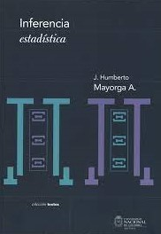

```{r setup, include=FALSE}
knitr::opts_chunk$set(echo = TRUE)
```

# Introducción

Sea $X_1,\ldots,X_n$ una muestra aleatoria de una población $X$ con función de densidad (masa) $f_X(x;\theta)$, con $\theta\in\Theta\subset\mathbb{R}$, y $T = T(X_1,\ldots,X_n)$ un estimador de $r(\theta)$. Entonces, 
$$
\textsf{P}\left(T = r(\theta)\right) = 0\,.
$$

En la **estimación por intervalo** para $r(\theta)$ se escoge un **nivel de confianza** (confiabilidad) $100(1-\alpha)\%$ y se construye un **intervalo aleatorio** (intervalo con al menos un extremo aleatorio) tal que la **probabilidad frecuentista** de que el **intervalo contenga a $r(\theta)$** sea $1-\alpha$.


**(Definición.)** Un **intervalo aleatorio** es un intervalo tal que al menos uno de sus extremos es una variable aleatoria.


**(Definición.)** Sea $X_1,\ldots,X_n$ una muestra aleatoria de una población $X$ con función de densidad (masa) $f_X(x;\theta)$, con $\theta\in\Theta\subset\mathbb{R}$, y $L_1 = L_1(X_1,\ldots,X_n)$ y $L_2 = L_2(X_1,\ldots,X_n)$ dos estadísticos tales que $\textsf{P}\left(L_1 < L_2\right) = 1$. El intervalo aleatorio $(L_1,L_2)$ se llama **intervalo de confianza** para $r(\theta)$ al $100(1-\alpha)\%$ de confianza, si
$$
\textsf{P}\left( L_1 < r(\theta) < L_2\right) = 1-\alpha\,.
$$
En este caso, $L_1$ y $L_2$ se conocen como **límite inferior** y **límite superior** del intervalo, respectivamente, y el valor $1-\alpha$ como **nivel de confianza** o **confiabilidad** del intervalo. Además, la realización del intervalo aleatorio $(L_1,L_2)$ se conoce como **estimación por intervalo** al $100(1 - \alpha)\%$ de confianza para $r(\theta)$.


**(Definición.)** Sea $X_1,\ldots,X_n$ una muestra aleatoria de una población $X$ con función de densidad (masa) $f_X(x;\theta)$, con $\theta\in\Theta\subset\mathbb{R}$, y sea $L_1 = L_1(X_1,\ldots,X_n)$ una estadística. El intervalo aleatorio $(L_1, b)$ es un **intervalo de confianza unilateral** para $r(\theta)$ al $100(1-\alpha)\%$ de confianza, si
$$
\textsf{P}\left( L_1 < r(\theta) < b \right) = 1-\alpha\,.
$$
Análogamente, el intervalo aleatorio $(a, L_2)$ es un **intervalo de confianza unilateral** para $r(\theta)$ al $100(1-\alpha)\%$ de confianza, si
$$
\textsf{P}\left(a < r(\theta) < L_2 \right) = 1-\alpha\,.
$$

# Método de la variable pivote

**(Definición.)** Sea $X_1,\ldots,X_n$ una muestra aleatoria de una población $X$ con función de densidad (masa) $f_X(x;\boldsymbol{\theta})$, con $\boldsymbol{\theta}\in\Theta\subset\mathbb{R}^k$. Sea $Q = Q(\boldsymbol{\theta},X_1,\ldots,X_n)$ una función de la muestra aleatoria y del parámetro de interés. $Q$ se denomina **cantidad pivotal** o **variable pivote** para el parámetro $\boldsymbol{\theta}$ si la distribución de $Q$ no depende de $\boldsymbol{\theta}$.


### Ejemplo {-}

Sea $X_1,\ldots,X_n$ una muestra aleatoria de una población Normal con media $\mu$ y varianza $\sigma^2$. Entonces,
$$
Q_1 = \frac{\bar{X} - \mu}{S/\sqrt{n}}
\qquad{y}\qquad
Q_2 = \frac{(n-1)S^2}{\sigma^2}
$$
son cantidades pivotales para $\mu$ y $\sigma^2$, respectivamente, dado que $Q_1\sim\textsf{t}_{n-1}$ y $Q_2\sim\chi^2_{n-1}$.


Sea $Q$ una cantidad pivotal para $r(\theta)$. El **método de la variable pivote** consiste en establecer un par de valores $a$ y $b$ tales que 
$$
\textsf{P}(a < Q < b) = 1-\alpha\,,
$$
y a partir de tal expresión, considerar **eventos equivalentes** hasta determinar el evento evento tal que
$$
\textsf{P}(L_1 < r(\theta) < L_2) = 1-\alpha\,.
$$

La elección de $a$ y $b$ es **arbitraria**. Tal elección puede ser única si se establecen **requerimientos adicionales** al intervalo (e.g., longitud mínima).

### Ejercicio {-}

Sea $X_1,\ldots,X_n$ una muestra aleatoria de una población Normal con media $\mu$ y varianza $\sigma^2$. Establecer un intervalo de confianza para $\mu$ a partir de la variable pivote $Q = \frac{\bar{X} - \mu}{S/\sqrt{n}}$.


### Ejercicio {-}

Sea $X_1,\ldots,X_n$ una muestra aleatoria de una población Normal con media $\mu$ y varianza $\sigma^2$. Hallar un intervalo de confianza para $\sigma$ a partir de la variable pivote $Q = \frac{(n-1)S^2}{\sigma^2}$.


### Ejercicio {-}

Sea $X_1,\ldots,X_n$ una muestra aleatoria de una población Exponencial con parámetro de razón $\theta$. Hallar un intervalo de confianza para $\theta$ utilizando el método de la variable pivote.

Sugerencia: Demostrar que $Y_i = 2\theta X_i \sim \textsf{Exp}(1/2)$, y en consecuencia, $Q=\sum_{i=1}^n Y_i \sim \chi^2_{2n}$. 


# Una variable pivote general

Sea $X_1,\ldots,X_n$ una muestra aleatoria de una población $X$ con función de distribución acumulada continua $F_X(x;\theta)$, con $\theta\in\Theta\subset\mathbb{R}$. Entonces, $U_i=F_X(X_i)\sim\textsf{U}(0,1)$ y $R_i = -\log U_i \sim \textsf{Exp}(1)$.

*Demostración:* Ejercicio.

Sea $X_1,\ldots,X_n$ una muestra aleatoria de una población $X$ con función de distribución acumulada continua $F_X(x;\theta)$, con $\theta\in\Theta\subset\mathbb{R}$. Sea $Q = -\sum_{i=1}^n \log F_X(X;\theta)$. Entonces, $Q\sim \textsf{Gamma}(n,1)$.

*Demostración:* Ejercicio.

Así, la variable aleatoria $Q = -\sum_{i=1}^n \log F_X(X;\theta)$ se puede utilizar como una variable pivote para $\theta$, siempre que $F_X(x;\theta)$ tenga una expresión que permita aplicar el método.


### Ejercicio {-}

Sea $X_1,\ldots,X_n$ una muestra aleatoria de una población $X$ con función de distribución acumulada continua $F_X(x;\theta)$, con $\theta\in\Theta\subset\mathbb{R}$. Demostrar que $Q = n -\sum_{i=1}^n \log F_X(X_i;\theta)$ es una cantidad pivotal para $\theta$.

Sugerencia: Considerar las variables aleatorias $U_i = 1 - F_X(X_i)\sim\textsf{U}(0,1)$.


### Ejercicio {-}

Sea $X_1,\ldots,X_n$ una muestra aleatoria de una población $X$ con función de distribución acumulada continua $F_X(x;\theta)$, con $\theta\in\Theta\subset\mathbb{R}$. Demostrar que $Q = -2\sum_{i=1}^n \log F_X(X_i;\theta)$ es una cantidad pivotal para $\theta$.


# Variables pivote asociadas con los MLEs

**(Teorema: Normalidad asintótica del MLE).** Bajo la condiciones de regularidad, se tiene que
$$
\frac{\hat{\theta}_{\text{MLE}} - \theta}{\sqrt{I_n^{-1}}} \xrightarrow{\text{d}} \textsf{Normal}\left(0,1\right)
\qquad\text{y}\qquad
\frac{\hat{\theta}_{\text{MLE}} - \theta}{\sqrt{\hat{I}_n^{-1}}} \xrightarrow{\text{d}} \textsf{Normal}\left(0,1\right)\,,
$$
donde $\hat{I}_n = I_n(\hat{\theta}_{\text{MLE}})$ es la **información observada de Fisher**.


### Ejercicio {-}

Sea $X_1,\ldots,X_n$ una muestra aleatoria de una población Bernoulli con parámetro $\theta$. Hallar un intervalo de confianza para $\theta$ utilizando la Normalidad asintótica del MLE.


### Ejercicio {-}

Sea $X_1,\ldots,X_n$ una muestra aleatoria de una población Poisson con parámetro $\theta$. Hallar un intervalo de confianza para $\theta$ utilizando la Normalidad asintótica del MLE.


# Intervalos de confianza para una población bajo Normalidad

Se asume que $X_1,\ldots,X_n$ es una muestra aleatoria de una población Normal con media $\mu$ y varianza $\sigma^2$.


## Para $\mu$ con $\sigma^2$ conocida

La variable aleatoria pivote es:
$$
Z=\frac{\bar{X}-\mu}{\sigma/\sqrt{n}}\sim \textsf{N}(0,1)\,.
$$

Entonces,
$$
\textsf{P}\left(\bar{X}-z_{1-\alpha/2}\frac{\sigma}{\sqrt{n}}\leq\mu\leq \bar{X}+z_{1-\alpha/2}\frac{\sigma}{\sqrt{n}}\right)=1-\alpha\,,
$$
donde $z_{1-\alpha/2}$ es el percentil $1-\alpha/2$ de una distribución Normal estándar.

En virtud del **Teorema del Límite Central**, este intervalo de confianza aplica incluso si la población no tiene distribución Normal, siempre y cuando el tamaño de la muestra $n$ sea **grande**.

Además, este intervalo corresponde al intervalo de confianza para $\mu$ al $100(1-\alpha)\%$ con longitud mínima. En efecto, se eligen los valores de $a$ y $b$ tales que $a < b$ sujetos a que $F_Z(b) - F_Z(a)=1-\alpha$, lo que produce un intervalo de la forma
$$
\textsf{P}\left(\bar{X} - b\,\frac{\sigma}{\sqrt{n}} < \mu < \bar{X} - a\,\frac{\sigma}{\sqrt{n}} \right)=1-\alpha\,,
$$
cuya longitud es $L=\frac{\sigma}{\sqrt{n}}(b-a)$.

Derivando $L$ respecto a $b$, se obtiene que
$$
\frac{\partial L}{\partial b} = \frac{\sigma}{\sqrt{n}}\left(1 - \frac{\partial a}{\partial b}\right)
\qquad\text{sujeto a}\qquad
f_Z(b) - f_Z(a)\frac{\partial a}{\partial b} = 0\,,
$$
Por lo tanto el punto crítico correspondiente satisface que
$$
\frac{\sigma}{\sqrt{n}}\left(1 - \frac{f_Z(b)}{f_Z(a)}\right) = 0
\qquad\Longleftrightarrow\qquad
f_Z(b) = f_Z(a)\,,
$$
de donde $a = z_{\alpha/2}$ y $b = z_{1-\alpha/2}$ pues la $f_Z$ es una función simétrica respecto a $0$.


## Para $\mu$ con $\sigma^2$ desconocida

La variable aleatoria pivote es:
$$
T=\frac{\bar{X}-\mu}{S/\sqrt{n}}\sim \textsf{t}_{n-1}\,,
$$
donde $S$ es la desviación estándar muestral y $\textsf{t}_{\nu}$ denota la distribución $\textsf{t}$ con $\nu$ grados de libertad.

Entonces,
$$
\textsf{P}\left(\bar{X}-\textsf{t}_{n-1,1-\alpha/2}\frac{S}{\sqrt{n}}\leq\mu\leq \bar{X}+\textsf{t}_{n-1,1-\alpha/2}\frac{S}{\sqrt{n}}\right)=1-\alpha\,,
$$
donde $\textsf{t}_{n-1,1-\alpha/2}$ es el percentil $1-\alpha/2$ de una distribución $\textsf{t}$ con $n-1$ grados de libertad.


### Ejemplo {-}

En el archivo `geriatra.txt` se presentan los datos de un estudio con individuos de por lo menos 65 años de edad en buenas condiciones físicas. 

Las variables del estudio son: 

- Caídas (número de caídas en el período).
- Intervención  (0 = educación solamente,  1 = educación y ejercicios físicos).
- Sexo (0 = femenino, 1 = masculino).
- Balance (puntuación).
- Fuerza (puntuación).

a. Hallar un intervalo de confianza para el promedio poblacional del balance al 95% de confianza.

```{r}
# datos
datos <- read.table("geriatra.txt")
names(datos) <- c("caidas", "intervencion", "sexo", "balance", "fuerza")
# inspección de los datos
class(datos)
dim(datos)
head(datos)
```

```{r}
# balance
y <- datos$balance
```

```{r}
# descripción
summary(y)
```

```{r,fig.width=8,fig.height=4, fig.align='center'}
# visualización
par(mfrow = c(1,2))
# histograma
hist(x = y, freq = F, col = "white", xlim = c(0,100), ylim = c(0,0.02), xlab = "Balance", ylab = "Densidad", main = "")
curve(expr = dnorm(x, mean = mean(y), sd = sd(y)), col = 2, add = TRUE)
# gráfico cuantil-cuantil
qqnorm(y, xlab = "Cuantiles normales", ylab = "Cuantiles observados", main = "")
qqline(y, col = 2)
```

```{r}
# tamaño de la muestra
(n <- length(y))
# promedio muestral
(xb <- mean(y))
# desviación estándar
(s <- sd(y))
# percentil t
(t975 <- qt(p = 0.975, df = n-1))
# percentil z
(z975 <- qnorm(p = 0.975))
# margen de error t
(met <- t975*s/sqrt(n))
# margen de error z
(mez <- z975*s/sqrt(n))
# IC t
(xb + c(-1,1)*met)
# IC z
(xb + c(-1,1)*mez)
```

```{r}
t.test(x = y, mu = 46, conf.level = 0.95)
```

b. De acuerdo con la Escala de Berg, un puntaje menor a 46 puntos indica la aparición de caídas múltiples con frecuencia. ¿La diferencia entre 46 puntos y la estimación del promedio poblacional del balance presenta **diferencias prácticas**? ¿El intervalo de confianza indica que el promedio poblacional del balance presenta **diferencias significativas** respecto a 46? 

- Diferencia práctica: diferencia entre dos cantidades lo suficientemente grande para que sea declarada como **relevante en términos de la aplicación de interés**.
- Diferencia significativa: diferencia entre un estadístico y una cantidad dada lo suficientemente grande para que sea declarada como **relevante a nivel poblacional y no consecuencia del error muestral**.

Como el intervalo de confianza correspondiente no contiene a 46, entonces existe suficiente evidencia empírica para declarar diferencias significativas entre el promedio poblacional del balance y el valor de referencia 46.


### Ejercicio {-}

En un estudio de *National Retail Foundation* se encontró que las familias estaban dispuestas a
gastar en promedio \$649 durante las vacaciones decembrinas (*The Wall Street Journal*, 2 de diciembre
de 2002). En el estudio participaron 600 familias y que la desviación estándar
muestral fue \$175.

a. ¿Con 95% de confianza cuál es el margen de error?
b. ¿Cuál es el intervalo de confianza de 95% para estimar la media poblacional?
c. El año anterior, la media poblacional de gastos por familia fue \$632. Analice la variación
en el gasto en las vacaciones decembrinas en este periodo de un año.


### Ejercicio {-}

Los salarios anuales iniciales de estudiantes que acaban de terminar una carrera específica
se espera que estén entre \$ 30000 y \$ 45000. Suponga que quiere dar un intervalo de confianza
de 95% para estimar la media poblacional de los salarios iniciales. El valor
planeado de la desviación estándar poblacional es \$ 3500. ¿Cuán grande deberá ser la muestra si quiere que
el margen de error sea:

a. \$ 500?
b. \$ 200?
c. \$ 100?
d. ¿Recomendaría tratar de tener \$100 como margen de error?

## Para $\sigma^2$ con $\mu$ desconocida

La variable aleatoria pivote es:
$$
\chi^2=\frac{(n-1)S^2}{\sigma^2}\sim\chi^2_{n-1}\,,
$$
donde $S$ es la desviación estándar muestral y $\chi^2_{\nu}$ denota la distribución $\chi^2$ con $\nu$ grados de libertad.

Entonces,
$$
\textsf{P}\left( \frac{(n-1)S^2}{\chi^2_{n-1,1-\alpha/2}} \leq\sigma^2\leq \frac{(n-1)S^2}{\chi^2_{n-1,\alpha/2}} \right)=1-\alpha\,,
$$
donde $\chi^2_{n-1,1-\alpha/2}$ es el percentil $1-\alpha/2$ de una distribución $\chi^2$ con $n-1$ grados de libertad.

### Ejemplo {-}

**Simular 100K de muestras aleatorias** de tamaño $n=10$ de una **población Normal** con media $\mu=10$ y desviación estándar $\sigma=1$, y para cada muestra aleatoria, calcular la **estimación** y el **intervalo de confianza** para $\sigma^2$ al 95\% de confianza correspondiente. ¿Cuál es la distribución muestral de la variable pivote? ¿Qué proporción de intervalos contiene el valor de $\sigma^2$?

```{r}
# parámetros de la población
mu <- 10
sigma <- 1
# tamaño de la muestra
n <- 10
# percentiles
(chi025 <- qchisq(p = 0.025, df = n-1))
(chi975 <- qchisq(p = 0.975, df = n-1))
# número de simulaciones
M <- 100000
# objeto para almacenar los promedios
S2 <- matrix(data = NA, nrow = M, ncol = 1)
IC <- matrix(data = NA, nrow = M, ncol = 2)
# simulación
set.seed(1)
for (i in 1:M) {
  x <- rnorm(n = n, mean = mu, sd = sigma)
  S2[i,1] <- var(x)
  IC[i,1] <- (n-1)*var(x)/chi975
  IC[i,2] <- (n-1)*var(x)/chi025
}
```

```{r}
# inspección del estimador
dim(S2)
head(S2, n = 5)
```

```{r}
mean(S2)
```

```{r, fig.align='center'}
# distribución de la cantidad pivotal
hist(x = (n-1)*S2/sigma^2, freq = F, col = "white", xlab = expression(chi^2), ylab = "Densidad", main = "")
curve(expr = dchisq(x, df = n-1), col = 2, add = TRUE)
```

```{r}
# inspección del IC
dim(IC)
head(IC, n = 5)
```

```{r}
# cobertura
tmp <- (IC[,1] < sigma^2) & (sigma^2 < IC[,2])
head(tmp, n = 10)
# proporción
mean(tmp)
```

### Ejemplo {-}

Para analizar el riesgo o la volatilidad al invertir en las acciones comunes de *Chevron Corpotation*
se toma una muestra de rendimiento porcentual total mensual. A continuación se presentan
los rendimientos de los 12 meses de 2005 (*Compustat*, 24 de febrero de 2006). El rendimiento total
es el precio más cualquier dividendo pagado.

| Mes | Rendimiento (%) | Mes | Rendimiento (%) |
|:---:|:---------------:|:---:|:---------------:|
| Enero   | 3.60   | Julio      | 3.74   |
| Febrero | 14.86  | Agosto     | 6.62   |
| Marzo   | -6.07  | Septiembre | 5.42   |
| Abril   | -10.82 | Octubre    | -11.83 |
| Mayo    | 4.29   | Noviembre  | 1.21   |
| Junio   | 3.98   | Diciembre  | -0.94  |

a. Calcule la varianza muestral y la desviación estándar muestral como medidas de la volatilidad
del rendimiento mensual total de Chevron.

```{r}
# datos
x <- c(3.60, 3.74, 14.86, 6.62, -6.07, 5.42, -10.82, -11.83, 4.29, 1.21, 3.98, -0.94)
# varianza
(s2 <- var(x))
# desviación estándar
(s <- sd(x))
```

b. Hallar un intervalo de 95% de confianza para la desviación estándar poblacional.

```{r}
# tamaño de la muestra
(n <- length(x))
# percentiles
(chi025 <- qchisq(p = 0.025, df = n-1))
(chi975 <- qchisq(p = 0.975, df = n-1))
# intervalo de confianza
c(sqrt((n-1)*var(x)/chi975), sqrt((n-1)*var(x)/chi025))
```

c. Validar los supuestos del intervalo de confianza calculado.

```{r}
# descripción
summary(x)
```

```{r,fig.width=8,fig.height=4,fig.align='center'}
# visualización
par(mfrow = c(1,2))
# histograma
hist(x = x, freq = F, col = "white", xlim = c(-15,15), ylim = c(0,0.1), xlab = "Balance", ylab = "Densidad", main = "")
curve(expr = dnorm(x, mean = mean(x), sd = sd(x)), col = 2, add = TRUE)
# gráfico cuantil-cuantil
qqnorm(x, xlab = "Cuantiles normales", ylab = "Cuantiles observados", main = "")
qqline(x, col = 2)
```


### Ejercicio {-}

Una pieza debe fabricarse con medidas de tolerancia muy estrechas para que
sea aceptada por el cliente. Las especificaciones de producción indican que la varianza máxima
en la longitud de la pieza debe ser 0.0004. Suponga que en 30 piezas la varianza muestral encontrada
es 0.0005. Use una confiabilidad del 95% para probar si se está violando la especificación de la varianza
poblacional. ¿Qué es necesario suponer para que estas inferencias tengan validez?


### Ejercicio {-}

Sea $X_1,\ldots,X_n$ una muestra aleatoria de una población Normal con media $\mu$ y varianza $\sigma^2$.
Establece un intervalo de confianza para $\sigma^2$ con $\mu$ conocida.


# Intervalo de confianza para la proporción poblacional

Se tiene una muestra aleatoria $X_1,\ldots,X_n$ de una población Bernoulli con probabilidad de éxito $\pi$. 

La variable aleatoria pivote es: 

$$
Z = \frac{P-\pi}{\sqrt{\frac{P(1-P)}{n}}}\sim \textsf{N}(0,1)
$$
donde $P=\frac{1}{n}\sum_{i=1}^n X_i$ es la proporción muestral, siempre que $n$ sea **grande**. Además, empíricamente se ha visto que esta aproximación es aceptable siempre que $n p \geq 5$ y $n(1 - p) \geq 5$.

Entonces,
$$
\textsf{Pr}\left(P-z_{1-\alpha/2}\sqrt{\frac{P(1-P)}{n}}\leq\pi\leq P+z_{1-\alpha/2}\sqrt{\frac{P(1-P)}{n}}\right)=1-\alpha\,,
$$
donde $z_{1-\alpha/2}$ es el percentil $1-\alpha/2$ de una distribución Normal estándar.


### Ejemplo {-}

**Simular 100K de muestras aleatorias** de tamaño $n=30$ de una **población Bernoulli** con media $\pi=0.3$, y para cada muestra aleatoria, calcular la **estimación** y el **intervalo de confianza** para $\pi$ al 95\% de confianza correspondiente. ¿Cuál es la distribución muestral de la variable pivote? ¿Qué proporción de intervalos contiene el valor de $\pi$?

```{r}
# parámetros de la población (modelo)
pii <- 0.3
# tamaño de la muestra
n <- 30
# percentiles
z975 <- qnorm(p = 0.975)
# número de simulaciones
M <- 100000
# objeto para almacenar los promedios
PI <- matrix(data = NA, nrow = M, ncol = 1)
IC <- matrix(data = NA, nrow = M, ncol = 2)
# simulación
set.seed(1)
for (i in 1:M) {
  x <- rbinom(n = n, size = 1, prob = pii)
  p <- mean(x)
  PI[i,1] <- p
  IC[i,1] <- p - z975*sqrt(p*(1-p)/n)
  IC[i,2] <- p + z975*sqrt(p*(1-p)/n)
}
```

```{r}
# inspección
dim(PI)
head(PI)
```

```{r}
mean(PI)
```

```{r, fig.align='center'}
# visualización de la cantidad pivotal
hist(x = (PI-pii)/sqrt(PI*(1-PI)/n), freq = F, col = "white", xlim = c(-4,4), xlab = "z", ylab = "Densidad", main = "")
curve(expr = dnorm(x), col = 2, add = TRUE)
```

```{r}
# inspección
dim(IC)
head(IC)
```

```{r}
# cobertura
tmp <- (IC[,1] < pii) & (pii < IC[,2])
head(tmp)
# proporción
mean(tmp)
```


### Ejercicio {-}

Considere el conjunto de datos `birthwt` de la librería `MASS` de `R`. Este conjunto de datos incluye el peso al nacer (en gramos) de 189 recién nacidos junto con algunas características de sus madres (e.g., edad). Los datos se recopilaron en *Baystate Medical Center, Springfield*, MA, durante 1986. Encontrar el intervalo de confianza al 95\% para la proporción poblacional de madres que fuman durante su embarazo (`birthwt$smoke`).


### Ejercicio {-}

Las concentraciones de contaminantes atmosféricos, como
monóxido de carbono (CO), se pueden medir con un espectrómetro.
En una prueba de calibración, se hicieron 50 mediciones
de una muestra de gas del laboratorio que se sabía
tenía una concentración de CO de 70 partes por millón
(ppm). Se considera que una medición es satisfactoria si está
dentro de 5 ppm de la concentración verdadera. De las 50
mediciones, 37 fueron satisfactorias.

a. ¿Qué proporción de mediciones de la muestra fue satisfactoria?
b. Determine un intervalo de confianza de 95% para la proporción
de mediciones hechas por este instrumento que
serán satisfactorias.
c. Determine un intervalo de confianza de 99% para la proporción
de mediciones hechas por este instrumento que
serán satisfactorias.
d. ¿Cuántas mediciones se debe tomar para especificar la
proporción de mediciones satisfactorias dentro de
$\pm$ 0.10 con una confianza de 95%?
d. ¿Cuántas mediciones se debe tomar para especificar la
proporción de mediciones satisfactorias dentro de
$\pm$ 0.10 con una confianza de 99%?


# Intervalos de confianza para dos poblaciones independientes bajo Normalidad

Se consideran **dos poblaciones**, a saber, $X\sim \textsf{N}(\mu_X,\sigma_X^2)$ y $Y\sim \textsf{N}(\mu_Y,\sigma_Y^2)$, de las cuales se tienen **muestras aleatorias independientes** $X_1,\ldots,X_{n_X}$ y $Y_1,\ldots,Y_{n_Y}$, respectivamente. 

El objetivo es **comparar los parámetros** de las dos poblaciones.


## Para $\mu_X-\mu_Y$ con varianzas poblacionales conocidas

La **variable aleatoria pivote** está dada por:
$$
Z=\frac{(\bar{X}-\bar{Y}) - (\mu_X-\mu_Y)}{\sqrt{\frac{\sigma_X^2}{n_X}+\frac{\sigma_Y^2}{n_Y}}}\sim \textsf{N}(0,1)\,,
$$
donde $\bar{X}=\frac{1}{n_X}\sum_{i=1}^{n_X} X_i$ y $\bar{Y}=\frac{1}{n_Y}\sum_{i=1}^{n_Y} Y_i$ son las **medias muestrales** correspondientes.

Entonces,
$$
\textsf{P}\left( (\bar{X}-\bar{Y})-\textsf{z}_{1-\alpha/2}\sqrt{\frac{\sigma_X^2}{n_X}+\frac{\sigma_Y^2}{n_Y}} < \mu_X - \mu_Y < (\bar{X}-\bar{Y}) + \textsf{z}_{1-\alpha/2}\sqrt{\frac{\sigma_X^2}{n_X}+\frac{\sigma_Y^2}{n_Y}} \right) = 1-\alpha\,,
$$
donde $\textsf{z}_{1-\alpha/2}$ es el percentil $1-\alpha/2$ de una distribución Normal estándar.

- El **margen de error** es $\textsf{z}_{1-\alpha/2}\sqrt{\frac{\sigma_X^2}{n_X}+\frac{\sigma_Y^2}{n_Y}}$.
- Este **IC es apropiado si las poblaciones tienen distribución Normal** (sin importar los tamaños de muestra). 
- Este **IC es apropiado si los tamaños de muestra son grandes** (sin importar las distribuciones poblacionales). 
- Cuando las muestras son pequeñas, es imperante que las distribuciones de las dos poblaciones sean Normales.

La **significancia estadística** (diferencias significativas) se establece por medio de los **signos del los límites del intervalo de confianza** para $\mu_X-\mu_Y$. 

Si **los dos límites tienen el mismo signo**, entonces, con una confiabilidad de $100(1-\alpha)\%$, existe suficiente **evidencia empírica** para declarar **diferencias significativas** entre $\mu_X$ y $\mu_Y$. 

La **significancia estadística no implica** necesariamente una **significancia práctica**.

¿Qué se puede concluir si los signos de los límites del intervalo no coinciden?


### Ejemplo {-}

Como parte de un estudio para evaluar las diferencias en la calidad entre dos centros de enseñanza respecto a las ciencias exactas, físicas y naturales (Biología, Física, Geología, Matemáticas y Química), se aplica un examen estandarizado a los individuos de ambos centros. 

En exámenes estandarizados ya practicados en diversas ocasiones, se ha obtenido una desviación estándar cercana a 10 puntos. Por lo tanto, es razonable asumir que las desviaciones estándar poblacionales son conocidas y ambas iguales a $10$ puntos en ambos grupos.

Se tienen los datos de dos muestras aleatorias de tamaños $35$ y $40$ para los centros de enseñanza A y B, respectivamente, para las cuales las medias muestrales correspondientes son $82$ y $78$ puntos. 

Si la diferencia de calidad se evalúa comparando las medias poblacionales de las puntuaciones obtenidas en el examen, usando una confiabilidad de 95\%, ¿estos datos indican que existe una diferencia significativa entre las medias poblacionales de los dos centros de enseñanza?

Población $X$: puntaje en el examen estadarizado en el centro de enseñanza A.

Población $Y$: puntaje en el examen estadarizado en el centro de enseñanza B.

Parámetro de interés: $\mu_X - \mu_Y$.

Información muestral del centro de enseñanza A: $n_X = 35$ y $\bar{x} = 82$.

Información muestral del centro de enseñanza B: $n_Y = 40$ y $\bar{y} = 78$.

Información poblacional del centro de enseñanza A: $\sigma_X = 10$.

Información poblacional del centro de enseñanza B: $\sigma_Y = 10$.


```{r}
# info muestral
nx   <- 35
ny   <- 40
xbar <- 82
ybar <- 78
# info poblacional
sigx <- 10
sigy <- 10
# estimación puntual
(EP <- xbar - ybar)
# margen de error al 95%
(ME <- qnorm(p = 0.975)*sqrt(sigx^2/nx + sigy^2/ny))
# intervalo de confianza al 95%
(IC <- EP + c(-1,1)*ME)
```


## Para $\mu_X-\mu_Y$ con varianzas poblacionales desconocidas homocedásticas

Varianzas poblacionales desconocidas homocedásticas: $\sigma_X^2 = \sigma_Y^2$.

La **variable aleatoria pivote** está dada por:
$$
T = \frac{\frac{(\bar{X}-\bar{Y}) - (\mu_X-\mu_Y)}{\sqrt{\frac{\sigma^2}{n_X}+\frac{\sigma^2}{n_Y}}}}{\sqrt{\frac{\frac{(n_X-1)S^2_{X}+(n_Y-1)S^2_{Y}}{\sigma^2}}{n_X+n_Y-2}}}\,,
$$
y por lo tanto,
$$
T=\frac{(\bar{X}-\bar{Y}) - (\mu_X-\mu_Y)}{S_p\sqrt{\frac{1}{n_X}+\frac{1}{n_Y}}}\sim \textsf{t}_{n_X+n_Y-2}\,,
$$
donde $S^2_p$ es la **varianza conjugada** de las muestras,
$$
S_p^2=\frac{(n_X-1)S^2_{X}+(n_Y-1)S^2_{Y}}{n_X+n_Y-2}
$$
con $S_x^2$ y $S_y^2$ las **varianza muestrales** correspondientes,
$$
S^2_{X}=\frac{1}{n_X-1}\sum_{i=1}^{n_X}(X_i-\bar{X})^2
\qquad\text{y}\qquad
S^2_{Y}=\frac{1}{n_Y-1}\sum_{i=1}^{n_Y}(Y_i-\bar{Y})^2.
$$

Entonces,
$$
\textsf{Pr}\left( (\bar{X}-\bar{Y})-\textsf{t}_{n_X+n_Y-2,1-\alpha/2}\,S_p\sqrt{\frac{1}{n_X}+\frac{1}{n_Y}} < \mu_X - \mu_Y < (\bar{X}-\bar{Y})+\textsf{t}_{n_X+n_Y-2,1-\alpha/2}\,S_p\sqrt{\frac{1}{n_X}+\frac{1}{n_Y}} \right) = 1-\alpha\,,
$$
donde $t_{n_X+n_Y-2,1-\alpha/2}$ es el percentil $1-\alpha/2$ de una distribución $\textsf{t}$ con $n_X+n_Y-2$ grados de libertad.

- El **margen de error** es $\textsf{t}_{n_X+n_Y-2,1-\alpha/2}\,S_p\sqrt{\frac{1}{n_X}+\frac{1}{n_Y}}$.
- Este **IC es apropiado si las poblaciones tienen distribución Normal** (sin importar los tamaños de muestra).
- Este **IC es apropiado si los tamaños de muestra son grandes** (sin importar las distribuciones poblacionales).
- Cuando las muestras son pequeñas, es imperante que las distribuciones de las dos poblaciones sean Normales.
- Puede que no se obtengan resultados satisfactorios si los tamaños de las muestras son muy distintos.


### Ejemplo {-}

En las zonas costeras de un país, hubo durante un periodo de tiempo determinado, un crecimiento relativamente rápido de la población. Los resultados que se presentan a continuación dan cuenta de las edades de dos muestras aleatorias e independientes de personas que viven tanto en zonas costeras como en zonas no costeras. 

|                   | Zona costera | Zona no costera |
|-------------------|:------------:|:---------------:|
| Tamaño muestral   | 150          | 175             |
| Media             | 39.3 años    | 31.4 años       |
| Desv. Estándar    | 15.0 años    | 15.2 años       |

Asumiendo que la variabilidad de la edad de las dos poblaciones es la misma, usando una confiabilidad de 95\%, calcular un intervalo de confianza para la diferencia de las medias de la edad de ambas poblaciones. ¿Existen diferencias significativas? ¿La diferencia es sustancial en términos prácticos? ¿Por qué es razonable asumir que las dos poblaciones son homocedásticas? ¿La distribución de las edades en ambas poblaciones tiene que ser Normal para llevar acabo este procedimiento?

Población $X$: edad (en años cumplidos) en la zona costera.

Población $Y$: edad (en años cumplidos) en la zona no costera.

Parámetro de interés: $\mu_X - \mu_Y$.

Información muestral de la zona costera: $n_X = 150$, $\bar{x} = 39.3$, y $s_x = 15.0$.

Información muestral de la zona no costera: $n_Y = 175$, $\bar{y} = 31.4$ y $s_y = 15.2$.

Información poblacional: $\sigma^2_X = \sigma^2_Y$.


```{r}
# info muestral
nx   <- 150
ny   <- 175
xbar <- 39.3
ybar <- 31.4
sx   <- 15.0
sy   <- 15.2 
# desviación estándar conjugada
(sp <- sqrt(((nx - 1)*sx^2 + (ny - 1)*sy^2)/(nx + ny - 2)))
# estimación puntual
(EP <- xbar - ybar)
# margen de error al 95% (Normal)
(ME <- qnorm(p = 0.975)*sp*sqrt(1/nx + 1/ny))
# margen de error al 95% (t)
(ME <- qt(p = 0.975, df = nx + ny - 2)*sp*sqrt(1/nx + 1/ny))
# intervalo de confianza al 99% (t)
(IC <- EP + c(-1,1)*ME)
```


## Para $\mu_X-\mu_Y$ con varianzas poblacionales desconocidas heterocedásticas

Varianzas poblacionales desconocidas heterocedásticas, $\sigma_X^2 \neq \sigma_Y^2$.

La **variable aleatoria pivote** está dada por:
$$
T=\frac{(\bar{X}-\bar{Y})-(\mu_X-\mu_Y)}{\sqrt{\frac{S^2_{X}}{n_X}+\frac{S^2_{Y}}{n_Y}}}\sim \textsf{t}_{\nu}
$$

donde $\nu$ denota los **grados de libertad** que de acuerdo con Welch corresponden al entero más cercano de
$$
\nu\approx\frac{\left(\frac{s^2_{X}}{n_X}+\frac{s^2_{Y}}{n_Y} \right)^2 }{\frac{\left( \frac{s^2_{X}}{n_X}\right)^2 }{n_X-1}+\frac{\left( \frac{s^2_{Y}}{n_Y}\right)^2 }{n_Y-1}}\,.
$$

Entonces:
$$
\textsf{Pr}\left( (\bar{X}-\bar{Y})-\textsf{t}_{\nu,1-\alpha/2}\sqrt{\frac{S^2_{X}}{n_X}+\frac{S^2_{Y}}{n_Y}} < \mu_X - \mu_Y < (\bar{X}-\bar{Y})+\textsf{t}_{\nu,1-\alpha/2}\sqrt{\frac{S^2_{X}}{n_X}+\frac{S^2_{Y}}{n_Y}} \right) = 1-\alpha\,,
$$
donde $\textsf{t}_{\nu,1-\alpha/2}$ es el percentil $1-\alpha/2$ de una distribución $t$ con $\nu$ grados de libertad.

- El **margen de error** es $\textsf{t}_{\nu,1-\alpha/2}\sqrt{\frac{S^2_{X}}{n_X}+\frac{S^2_{Y}}{n_Y}}$.
- Este **IC es apropiado si las poblaciones tienen distribución Normal** (sin importar los tamaños de muestra). 
- Este **IC es apropiado si los grados de libertad son grandes** (sin importar las distribuciones poblacionales), en cuyo caso $\textsf{t}\approx \textsf{N}(0,1)$.
- Cuando las muestras son pequeñas, es fundamental que las distribuciones de las dos poblaciones sean Normales.


### Ejemplo {-}

En el artículo **Bactericidal Properties of Flat Surfaces and Nanoparticles Derivatized with Alkylated Polyethylenimines** (J. Lin, S. Qiu y colaboradores, en *Biotechnology Progress*,
2002:1082-1086), se describen experimentos en los  que se fijó polietileniminas alquiladas a superficies y a nanopartículas para hacerlas bactericidas. 

En una serie de experimentos, la eficiencia bactericida contra la bacteria E. Coli fue comparada para un metilado contra un polímero no metilado. La media del porcentaje de células de bacterias muertas con el polímero metilado era de 95 con una desviación estándar de 1, y la media del porcentaje de células de bacterias muertas con el polímero no metilado era de 70 con una desviación estándar 6.

Se hicieron cinco mediciones independientes para cada tipo de polímero. Determine un intervalo de confianza de 95\% para el aumento en la eficiencia bactericida del polímero metilado. ¿Qué es indispensable suponer para construir este intervalo de confianza usando los métodos tradicionales?

Población $X$: porcentaje de células de bacterias muertas con el polimero metilado.

Población $Y$: porcentaje de células de bacterias muertas con el polimero no metilado.

Parámetro de interés: $\mu_X - \mu_Y$.

Información muestral del polimero    metilado: $n_X = 5$, $\bar{x} = 95$, y $s_X = 1$.

Información muestral del polimero no metilado: $n_Y = 5$, $\bar{y} = 70$, y $s_Y = 6$.

Información poblacional: $\sigma^2_X \neq \sigma^2_Y$.

```{r}
# info muestral
nx   <- 5
ny   <- 5
xbar <- 95
ybar <- 70
sx   <- 1
sy   <- 6 
# grados de libertad
(v <- round((sx^2/nx + sy^2/ny)^2/((sx^2/nx)^2/(nx-1) + (sy^2/ny)^2/(ny-1))))
# estimación puntual
(EP <- xbar - ybar)
# margen de error al 95% (Normal)
(ME <- qnorm(p = 0.975)*sqrt(sx^2/nx + sy^2/ny))
# margen de error al 95% (t)
(ME <- qt(p = 0.975, df = v)*sqrt(sx^2/nx + sy^2/ny))
# intervalo de confianza al 95% (t)
(IC <- EP + c(-1,1)*ME)
```


## Para el cociente de varianzas $\sigma^2_Y/\sigma^2_X$ con medias desconocidas

El **estimador puntual** de $\frac{\sigma^2_{Y}}{\sigma^2_{X}}$ es $\frac{S^2_{Y}}{S^2_{X}}$.

La **variable aleatoria pivote** está dada por:
$$
F=\frac{\frac{S^2_{X}}{\sigma_X^2}}{\frac{S^2_{Y}}{\sigma_Y^2}}\sim \textsf{F}_{n_X-1,n_Y-1}\,.
$$

Entonces,
$$
\textsf{Pr}\left( \frac{S^2_{Y}}{S^2_{X}}\textsf{F}_{n_X-1,n_Y-1,\alpha/2} < \frac{\sigma^2_Y}{\sigma^2_X}  <\frac{S^2_{Y}}{S^2_{X}}\textsf{F}_{n_X-1,n_Y-1,1-\alpha/2} \right) = 1-\alpha\,,
$$
donde $F_{n_X-1,n_Y-1,\alpha/2}$ y $F_{n_X-1,n_Y-1,1-\alpha/2}$ son respectivamente los percentiles $\alpha/2$ y $1-\alpha/2$ de una distribución $\textsf{F}$ con $n_X-1$ grados de libertad en el numerador y $n_Y-1$ grados de libertad en el denominador.

- Este **IC es apropiado si las poblaciones tienen distribución Normal** (sin importar los tamaños de muestra).
- Cuando las muestras son pequeñas, es fundamental que las distribuciones de las dos poblaciones sean Normales.


### Ejemplo {-}

*Media Metrix and Jupiter Communications* recogieron datos sobre la cantidad de tiempo que pasan
conectados a Internet, por mes, adultos y jóvenes (*USA Today*, 14 de septiembre de 2000).
Se concluyó que, en promedio, los adultos pasan más tiempo conectados a Internet que los jóvenes.

Para confirmar esto se realiza otro estudio para el que se toma una muestra
de 26 adultos y otra de 30 jóvenes. Las desviaciones estándar de las cantidades de tiempo que
pasan conectados a Internet son 94 y 58 minutos, respectivamente. 

¿Estos resultados muestrales
favorecen la conclusión de que en el caso de los adultos la variabilidad del tiempo que pasan conectados
a Internet es mayor que en el caso de los jóvenes? Use una confiabilidad del 95\%. ¿Qué es indispensable suponer para construir este intervalo de confianza usando los métodos tradicionales?

Población $X$: cantidades de minutos que pasan conectados a Internet los adultos.

Población $Y$: cantidades de minutos que pasan conectados a Internet los jóvenes.

Parámetro de interés: $\sigma^2_Y/\sigma^2_X$.

Información muestral de los adultos: $n_X = 26$ y $s_X = 94$.

Información muestral de los jóvenes: $n_Y = 30$ y $s_Y = 58$.

```{r}
# info muestral
nx <- 26
ny <- 30
sx <- 94
sy <- 58
# estimación puntual
(EP <- sy^2/sx^2)
# intervalo de confianza al 95% (F)
(IC <- (sy^2/sx^2)*c(qf(p = 0.025, df1 = nx-1, df2 = ny-1), qf(p = 0.975, df1 = nx-1, df2 = ny-2)))
```

### Ejercicio {-}

Una administradora de sistemas computacionales observa
que las computadoras que corren en un sistema operativo
especial parecen paralizarse más a menudo conforme pasa
el tiempo desde la instalación del sistema operativo. Ella
mide el tiempo (en minutos) antes de que se paralice para
siete computadoras un mes después de la instalación, y para
nueve computadoras siete meses después. Los resultados
fueron:

Un mes después de la instalación: 207.4, 233.1, 215.9, 235.1, 225.6, 244.4, 245.3.

Siete meses después de la instalación: 84.3, 53.2, 127.3, 201.3, 174.2, 246.2, 149.4, 156.4, 103.3.

Determine un intervalo de confianza de 95\% para la diferencia
de las medias en el tiempo en que se paraliza entre el
primero y el séptimo meses.

### Ejercicio {-}

La varianza en un proceso de producción es un indicador importante de la calidad del proceso.
Las varianzas grandes representan una oportunidad para mejorar un proceso, hallando maneras
de reducir esa varianza. Realice un intervalo de confianza para determinar si existe una diferencia
significativa entre las varianzas de los pesos de las bolsas procesadas con dos máquinas diferentes.
Use 95\% como nivel de confianza. ¿Cuál es la conclusión? ¿Representa alguna de las dos
máquinas una oportunidad para mejorar la calidad?

Máquina 1: 2.95,, 3.45, 3.50, 3.75, 3.48, 3.26, 3.33, 3.20,
3.16, 3.20, 3.22, 3.38, 3.90, 3.36, 3.25, 3.28,
3.20, 3.22, 2.98, 3.45, 3.70, 3.34, 3.18, 3.35,
3.12.

Máquina 2: 3.22,  3.30,  3.34,  3.28,  3.29,  3.25,  3.30,  3.27,
3.38,  3.34,  3.35,  3.19,  3.35,  3.05,  3.36,  3.28,
3.30,  3.28,  3.30,  3.20,  3.16,  3.33.

# Diferencia de proporciones $\pi_X-\pi_Y$

Se consideran **dos poblaciones**, a saber, $X\sim Ber(\pi_X)$ y $Y\sim Ber(\pi_Y)$, de las cuales se tienen las **muestras aleatorias independientes** $X_1,\ldots,X_{n_X}$ y $Y_1,\ldots,Y_{n_Y}$, respectivamente.

La **variable aleatoria pivote** está dada por:
$$
Z=\frac{(P_X-P_Y) - (\pi_X-\pi_Y)}{\sqrt{\frac{P_X(1-P_X)}{n_X}+\frac{P_Y(1-P_Y)}{n_Y}}}\sim \textsf{N}(0,1)
$$
donde $P_X=\frac{1}{n_X}\sum_{i=1}^{n_X} X_i$ y $P_Y=\frac{1}{n_Y}\sum_{i=1}^{n_Y} Y_i$ son las **proporciones muestrales**.

Entonces,
$$
\textsf{Pr}\left( (P_X-P_Y)-\textsf{z}_{1-\alpha/2}\sqrt{\frac{P_X(1-P_X)}{n_X}+\frac{P_Y(1-P_Y)}{n_Y}} <\pi_X-\pi_Y< (P_X-P_Y)+\textsf{z}_{1-\alpha/2}\sqrt{\frac{P_X(1-P_X)}{n_X}+\frac{P_Y(1-P_Y)}{n_Y}} \right) = 1-\alpha
$$
donde $\textsf{z}_{1-\alpha/2}$ es el percentil $1-\alpha/2$ de una distribución Normal estándar.

- El **margen de error** es $\textsf{z}_{1-\alpha/2}\sqrt{\frac{P_X(1-P_X)}{n_X}+\frac{P_Y(1-P_Y)}{n_Y}}$.
- Este **IC es apropiado si las los tamaños de muestra son grandes**.


### Ejemplo {-}

Los extractos de *St. John's Wort* se utilizan ampliamente para tratar la depresión. Un artículo del número del 18 de abril de 2001 del *Journal of the American Medical Association*, títulado *Effectiveness of St. John's Wort on Major Depression: A Randomized Controlled Trial*, comparó la eficacia de un extracto estándar de *St. John’s Wort* con un placebo en 200 pacientes  diagnosticados de depresión mayor. 

Los pacientes fueron asignados aleatoriamente a dos grupos (50/50). Un grupo recibió la hierba y el otro recibió el placebo. Después de 8 semanas, 19 de los pacientes tratados con placebo mostraron una mejoría y 27 de los tratados con *St. John's Wort* mejoraron. ¿Existe alguna razón para creer que el tratamiento es eficaz para tratar la depresión mayor? Use una confiabilidad del 95\%.

Población $X$: 1 = mejoría, 0 = no mejoría en el tratamiento.

Población $Y$: 1 = mejoría, 0 = no mejoría en el placebo.

Parámetro de interés: $\pi_X - \pi_Y$.

Información muestral de los tratados con *St. John's Wort*: $n_X = 100$ y $P_X = 27/100$.

Información muestral de los tratados con placebo: $n_Y = 100$ y $P_Y = 19/100$.

```{r}
# info muestral
nx <- 100
ny <- 100
px <- 27/100
py <- 19/100
# estimación puntual
EP <- px - py
print(EP)
# margen de error al 95% (Normal)
(ME <- qnorm(p = 0.975)*sqrt(px*(1-px)/nx + py*(1-py)/ny))
# intervalo de confianza al 95% (F)
(IC <- EP + c(-1,1)*ME)
```


### Ejercicio {-}

En una encuesta de *BusinessWeek/Harris* se pidió a los ejecutivos de empresas grandes su opinión
acerca de sus perspectivas económicas para el futuro. Una de las preguntas era: ¿Piensa usted
que en los próximos 12 meses aumentará en su empresa el número de empleados de tiempo
completo? En esa encuesta 220 de 400 ejecutivos contestaron sí, mientras que en la encuesta realizada
el año anterior, 192 de 400 respondieron sí. Encuentre un intervalo de confianza de 95\%
para estimar la diferencia entre las proporciones en estas dos encuestas. Dé su interpretación de
la estimación por intervalo.


# Bootstrap

El ***Bootstrap*** es un **método general** para hacer inferencia estadística porque **no se basa en ningún supuesto distribucional acerca de los datos** y es bastante fácil de entender como de implementar.

## Algoritmo

1. Obtener una realización $x_1,\ldots,x_n$ de una muestra aleatoria $X_1,\ldots,X_n$ de tamaño $n$ de una distribución $F_X(\theta)$ con parámetro $\theta$.
2. Establecer un estimador $T=T(X_1,\ldots,X_n)$ del parámetro $\theta$. 
3. Tomar una muestra aleatoria $x_1^*,\ldots,x_n^*$ con reemplazo de tamaño $n$ de la muestra original $x_1,\ldots,x_n$. La muestra $x_1^*,\ldots,x_n^*$ se denomina remuestra.
4. Calcular el estadístico $T$ a partir de la remuestra, es decir, calcular $t^*=t^*(x_1^*,\ldots,x_n^*)$.
5. Almacenar el valor de $t^*$.
6. Repetir $M$ veces los pasos 3., 4. y 5. (e.g., $M=1000$).

### Ejemplo {-}

Considere una muestra aleatoria de tamaño $n=30$ de una distribución chi cuadrado con parámetro $\nu = 3$.

```{r}
n  <- 30
nu <- 3
set.seed(12345)
muestra <- rchisq(n = n, df = nu)
```

```{r, fig.align='center'}
hist(x = muestra, freq = F, col = 16, border = 16, xlim = c(0,12), xlab = "x", ylab = "Densidad", main = "")
curve(expr = dchisq(x, df = nu), lwd = 2, col = 2, add = T)
legend("topright", legend = c("Muestra","Población"), col = c(16,2), lwd = 2)
```

Bootstrap para la media de la población $\mu = \nu = 3$:

```{r}
# Bootstrap
M <- 1000
xb_boot <- matrix(data = NA, nrow = M, ncol = 1)
set.seed(5)
for (i in 1:M) {
  xr <- sample(x = muestra, size = n, replace = TRUE)
  xb_boot[i] <- mean(xr)
}
```

```{r}
head(xb_boot)
```


## Principio

El **principio del Bootstrap** indica que:

1. La distribución empírica de la remuestra $F_X^*$ es aproximadamente igual a la distribución de la muestra original $F_X$.
2. La variabilidad del estimador calculado en las remuestras $t_1^*,\ldots,t_M^*$ es aproximadamente igual a la variabilidad del estimador $T$.

### Ejemplo {-}

Distribución de los estimadores calculados en las remuestras:

```{r, fig.align='center'}
hist(x = xb_boot, freq = F, col = 16, border = 16, xlim = mean(xb_boot) + c(-1,1)*5*sd(xb_boot), xlab = "Media", ylab = "Densidad", main = "Media de remuestras")
curve(expr = dnorm(x, mean(xb_boot), sd(xb_boot)), col = 1, lwd = 2, add = T)
abline(v = nu, col = 2, lwd = 2)
abline(v = mean(muestra), col = 4, lwd = 2)
abline(v = quantile(xb_boot, probs = c(0.025,0.975)), col = 3, lwd = 2, lty = 4)
legend("topleft", legend = c("Remuestras","Media Mues.","Media Pobl.","Dist. Normal","Per. 2.5 y 97.5"), col = c(16,4,2,1,3), lwd = 2)
```


## Intervalo de confianza basado en percentiles

El intervalo de confianza calculado se obtiene mediante los percentiles $t^*_{\alpha/2}$ y $t^*_{1-\alpha/2}$ del estimador calculado en las remuestras $t_1^*,\ldots,t_M^*$:
$$
\textsf{IC}_{100(1-\alpha)\%}(\theta) = \left(t^*_{\alpha/2},t^*_{1-\alpha/2}\right)\,.
$$

### Ejemplo {-}

```{r}
# IC percentiles
quantile(xb_boot, probs = c(0.025,0.975))
```

## Intervalo de confianza empírico

Si la distribución de $T-\theta$ se aproxima mediante la distribución de $t^*-t$, entonces
$$
\textsf{Pr}\left( t^*_{\alpha/2} - t < T   - \theta < t^*_{1-\alpha/2} - t  \right) = 1-\alpha \\
$$
y por lo tanto el intervalo de confianza calculado es
$$
\textsf{IC}_{100(1-\alpha)\%}(\theta) = \left(2t-t^*_{1-\alpha/2},2t - t^*_{\alpha/2}\right)\,.
$$

### Ejemplo {-}

```{r}
2*mean(muestra) - quantile(xb_boot, probs = c(0.975,0.025))
```


## Intervalo de confianza Normal

Si $T$ es un estimador insesgado de $\theta$ y el estimador calculado en las remuestras $t_1^*,\ldots,t_M^*$ tiene distribución Normal, entonces
$$
\textsf{IC}_{100(1-\alpha)\%}(\theta) = \left( t - \textsf{z}_{1-\alpha/2}\,s_{t^*} , t+ \textsf{z}_{1-\alpha/2}\,s_{t^*} \right)\,.
$$

### Ejemplo {-}

```{r}
mean(muestra) + c(-1,1)*qnorm(p = 0.975)*sd(xb_boot)
```

### Ejemplo {-}

Los intervalos de confianza para $\mu$ usando Boostrap y el método clásico son:

```{r}
tab <- rbind(quantile(xb_boot, probs = c(0.025,0.975)),
             2*mean(muestra) - quantile(xb_boot, probs = c(0.975,0.025)),
             mean(muestra) + c(-1,1)*qnorm(p = 0.975)*sd(xb_boot),
             mean(muestra) + c(-1,1)*qt(p = 0.975, df = n-1)*sd(muestra)/sqrt(n))
colnames(tab) <- c("L. Inferior","L. Superior")
rownames(tab) <- c("IC Percentiles","IC Empírico","IC Normal","IC Clásico")
round(tab, 2)
```


### Ejemplo {-}

Evaluar la cobertura de los intervalos del ejemplo anterior.

```{r}
n <- 30
nu <- 3
N <- 1000
M <- 1000
z975 <- qnorm(p = 0.975)
t975 <- qt(p = 0.975, df = n-1)
IC_boot1 <- matrix(data = NA, nrow = N, ncol = 2)
IC_boot2 <- matrix(data = NA, nrow = N, ncol = 2)
IC_boot3 <- matrix(data = NA, nrow = N, ncol = 2)
IC_class <- matrix(data = NA, nrow = N, ncol = 2)
set.seed(12345)
for (k in 1:N) {
  # datos
  muestra <- rchisq(n = n, df = 3)
  mm <- mean(muestra)
  # IC bootstrap
  xb_boot <- matrix(data = NA, nrow = M, ncol = 1)
  for (i in 1:M) {
    xb_boot[i] <- mean(sample(x = muestra, size = n, replace = TRUE))
  }
  IC_boot1[k,] <- quantile(xb_boot, probs = c(0.025,0.975))
  IC_boot2[k,] <- 2*mm - quantile(xb_boot, probs = c(0.975,0.025))
  IC_boot3[k,] <- mm + c(-1,1)*z975*sd(xb_boot)
  # IC clásico
  IC_class[k,] <- mm + c(-1,1)*t975*sd(muestra)/sqrt(n)
}
```


```{r}
mu <- nu
tab <- rbind(mean((IC_boot1[,1] < mu) & (mu < IC_boot1[,2])),
             mean((IC_boot2[,1] < mu) & (mu < IC_boot2[,2])),
             mean((IC_boot3[,1] < mu) & (mu < IC_boot3[,2])),
             mean((IC_class[,1] < mu) & (mu < IC_class[,2])))
colnames(tab) <- c("Cobertura")
rownames(tab) <- c("IC Percentiles","IC Empírico","IC Normal","IC Clásico")
round(tab, 3)
```


# Referencias {-}

```{r, eval = TRUE, echo=FALSE, out.width="25%", fig.pos = 'H', fig.align = 'center'}

```

```{r, eval = TRUE, echo=FALSE, out.width="25%", fig.pos = 'H', fig.align = 'center'}
knitr::include_graphics("ramachandran_tsokos.png")
```

```{r, eval = TRUE, echo=FALSE, out.width="25%", fig.pos = 'H', fig.align = 'center'}
knitr::include_graphics("casella_berger.jpg")
```
