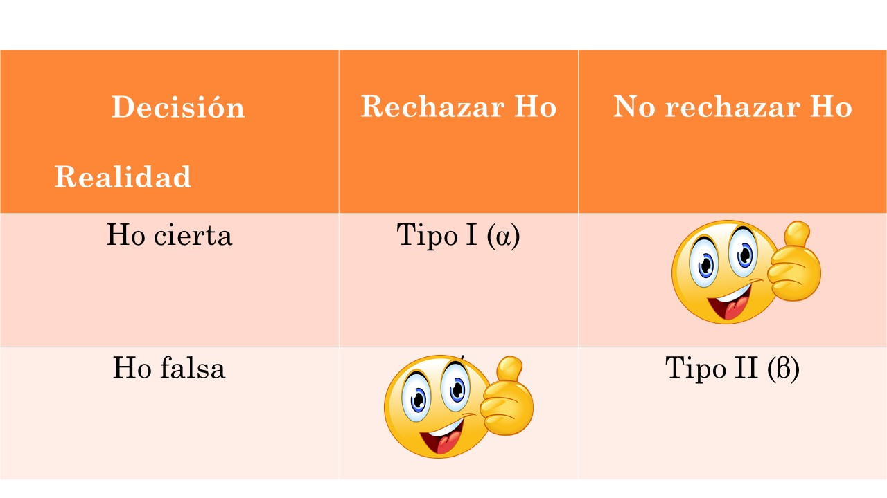

```{r setup, include=FALSE}
knitr::opts_chunk$set(echo = TRUE)
```

# Introducción

Las **pruebas de hipótesis** son una herramienta alternativa para hacer inferencia estadística sobre los parámetros de una población.

En **pruebas de hipótesis** se busca **rechazar** o **no rechazar** una afirmación acerca de una **característica de la población**, con base en la **información de una muestra aleatoria** de la población.

# Conceptos preliminares

Para **probar una hipótesis estadística**, se utiliza directamente el método científico:

1. Establecer el **estado actual del conocimiento** (Statu Quo).
2. Proponer un   **sistema de hipótesis** acerca del fenómeno de interés.
3. Observar una  **muestra aleatoria** (experimentar).
4. Analizar los  **resultados** respecto a las hipótesis bajo consideración.
5. Tomar         **decisiones** con base en los datos obtenidos.

## Sistema de hipótesis

**Hipótesis estadística** ($H$): **afirmación sobre la distribución de la población**, que comúnmente se expresa por medio de un parámetro $\theta\in\Theta$, donde $\Theta$ es el conjunto de todos los posibles valores que puede asumir $\theta$. 

**Hipótesis nula** ($H_0$): **hipótesis que refleja el estado actual de conocimiento de la población**. Es la hipótesis que al final del protocolo se debe **rechazar** o **no rechazar**.
$$
H_0: \theta\in\Theta_0\qquad \text{donde $\Theta_0\subset\Theta$.}
$$

**Hipótesis alternativa** ($H_1$): **hipótesis sobre la cual se quiere hallar evidencia empírica**.
$$
H_1: \theta\in\Theta_1\qquad\text{donde $\Theta_1\subseteq\Theta$ y $\Theta_0\cap\Theta_1=\emptyset$.}
$$

**Sistema de hipótesis**: **pareja de hipótesis conformada por la hipótesis nula y la hipótesis alternativa**.

$$H_0: \theta\in\Theta_0\qquad \text{frente a}\qquad H_1: \theta\in\Theta_1\,.$$
**Test** ($\tau$): **regla**, **norma**, **procedimiento** o **protocolo** que permite tomar una decisión (rechazar $H_0$ o no rechazar $H_0$).

**Observaciones**:

- Las hipótesis son **afirmaciones acerca de la población**, que por lo general se expresan por medio de los **parámetros de la población**.
- El objetivo consiste en establecer si existe **suficiente evidencia** en la **realización de una muestra aleatoria** para **rechazar** $H_0$ o **no rechazar** $H_0$, es decir, identificar **cuál es la hipótesis que mejor explica los datos observados**.

## Ejemplo

En un juicio el acusado se considera inocente hasta que se demuestre lo contrario más allá de cualquier duda razonable.

- **Sistema de hipótesis**: $H_0:$ El acusado es inocente frente a $H_1:$ El acusado es culpable.

## Ejemplo

Cierto tipo de motor de automóvil emite una media de 100 mg de óxidos de nitrógeno (NO) por segundo con 100 caballos de fuerza. Se ha propuesto una modificación al diseño del motor para reducir las emisiones de NO. El nuevo diseño se producirá si se demuestra que la media de las emisiones es menor de 100 mg/seg. Se construye y se prueba una muestra de 50 motores modificados. La media muestral de emisiones de NO es de 92 mg/s, y la desviación estándar muestral es de 21 mg/s.

- **Población**: emisiones de NO (mg/s) de los motores con el diseño del motor modificado.
- **Valor hipotético**: $\mu_0=100$.
- **Sistema de hipótesis**: $H_0:\mu = 100$ frente a $H_1:\mu < 100$.
- **Información muestral**: $n=50$, $\bar{x} = 92$ mg/s, y $s = 21$ mg/s.

## Errores

Cuando se hace una prueba de hipótesis podría ocurrir que la muestra no dé evidencias acerca de lo que ocurre en la población:

```{r, eval = TRUE, echo=FALSE, out.width="50%", fig.pos = 'H', fig.align = 'center'}

```

El **error tipo I** consiste en **rechazar la hipótesis nula, cuando ésta es cierta**. 

La **probabilidad de cometer el error tipo I** se llama **nivel de significancia** ($\alpha$) y **se fija antes de iniciar el estudio**:

$$\alpha = \textsf{Pr}(\text{Rechazar }H_0\mid H_0\text{ es cierta}).$$

El complemento de $\alpha$ es la **confiabilidad**:

$$1-\alpha = \textsf{Pr}(\text{No rechazar }H_0\mid H_0\text{ es cierta}).$$

El **error tipo II** consiste en **no rechazar la hipótesis nula, cuando ésta es falsa**. 

La **probabilidad de cometer el error tipo II** se llama **función característica** y se denota con $\beta(\theta)$. Esta función se puede calcular para cada $\theta\in\Theta_1$:

$$\beta(\theta)=\textsf{Pr}(\text{No rechazar }H_0\mid H_0\text{ es falsa}).$$

El complemento de $\beta(\theta)$ se llama **función de potencia**:

$$\pi(\theta)=1-\beta(\theta) = \textsf{Pr}(\text{Rechazar }H_0\mid H_0\text{ es falsa}).$$

## Observaciones

- El nivel de significancia se fija de antemano a 0.1, 0.05, o 0.01. 
- $H_0$ se mantiene a menos de que haya suficiente evidencia para revocarla.
- Para rechazar $H_0$ se debe observar algo en la muestra tan improbable que ocurra si $H_0$ es cierta, que obliga al investigador a favorecer $H_1$ (rechazar $H_0$).

## Ejemplo

En el ejemplo del juicio:

- Error tipo I:  establecer que el acusado es culpable, cuando en realidad es inocente.
- Error tipo II: establecer que el acusado es inocente, cuando en realidad es culpable.

## Ejemplo

En el ejemplo de emisiones de óxidos de nitrógeno (NO):

- Error tipo I: establecer que el diseño del motor modificado sí reduce las emisiones de NO promedio a menos de 100 mg/seg, cuando en realidad no lo hace.
- Error tipo I: establecer que el diseño del motor modificado no reduce las emisiones de NO promedio a menos de 100 mg/seg, cuando en realidad sí lo hace.

## Procedimiento de prueba

¿Cómo decidir si se debe rechazar o no la hipótesis nula?

1. Establecer el sistema de hipótesis.
2. Fijar el nivel de significancia.
2. Establecer la región de crítica y/o calcular el valor $p$.
3. Tomar la decisión.
4. Interpretar los resultados.

## Región crítica

Recorrido del estadístico de prueba correspondiente al nivel de significancia.

El test consiste en:

$$\tau:\text{Rechazar }H_0\text{ el estadístico de prueba pertenece a la región de rechazo.}$$

## Valor $p$ ($p$-value)

El valor $p$ se define como
$$
p = \textsf{Pr}(\text{Observar datos tan o más extremos en dirección de } H_1\mid H_0\text{ es cierta}).
$$
El test consiste en:

$$\tau:\text{Rechazar }H_0\text{ si el valor }p<\alpha.$$

## Ejemplo

En el ejemplo de emisiones de óxidos de nitrógeno (NO):

**Sistema de hipótesis**: $H_0:\mu = 100$ frente a $H_1:\mu < 100$.

**Nivel de significancia**: $\alpha = 0.05$.

**Valor $p$**: 

Bajo $H_0$, se tiene que el **estadístico de prueba** es

$$Z = \frac{\bar{X} - \mu_0}{S/\sqrt{n}}\sim\textsf{N}(0,1),$$
que al calcularse con la información muestral ($n=50$, $\bar{x} = 92$, $s = 21$) da como resultado $z_c=-2.69$.

La **región crítica** (región de rechazo) es $(-\infty,-1.64)$.

```{r}
# info muestral
n   <- 50
xb  <- 92
s   <- 21
# valor hipotetico
mu0 <- 100
# estadistico de prueba
est <- (xb - mu0)/(s/sqrt(n))
print(est)
# percentil 5% (cola izquierda)
z05 <- qnorm(p = 0.05)
z05
```

```{r, fig.align='center', echo = F}
n   <- 50
xb  <- 92
s   <- 21
mu0 <- 100
est <- (xb - mu0)/(s/sqrt(n))
z05 <- qnorm(p = 0.05)
curve(expr = dnorm(x), col = 1, lwd = 2, from = -4, to = 4, xlab = "z", ylab = "Densidad", main = "")
grid <- seq(from = -4, to = z05, len = 1000)
polygon(x = c(-4,grid,z05), y = c(0,dnorm(grid),0), col = "orange", border = "orange")
grid <- seq(from = z05, to = 4, len = 1000)
polygon(x = c(z05,grid,4), y = c(0,dnorm(grid),0), col = "lavenderblush", border = "lavenderblush")
text(x =  3, y = 0.22, "95%", cex = 2.5, col = "lavenderblush3")
text(x = -3.4, y = 0.1, "5%", cex = 2.5, col = "orange")
curve(expr = dnorm(x), col = 1, lwd = 2, add = T)
abline(v = est, col = 2, lwd = 2)
legend("topright", legend = c("z = -2.69"), col = 2, lwd = 2, bty = "n")
```

El valor $p$ es 

$$p = \textsf{Pr}(Z < z_c\mid H_0\text{ es cierta}) = \int_{-\infty}^{z_c} f_Z(z)\,\textsf{d}z = 0.003532762$$
```{r}
# valor p
pnorm(q = est, lower.tail = TRUE)
```

```{r, fig.align='center', echo = F}
n   <- 50
xb  <- 92
s   <- 21
mu0 <- 100
est <- (xb - mu0)/(s/sqrt(n))
z05 <- qnorm(p = 0.05)
curve(expr = dnorm(x), col = 1, lwd = 2, from = -4, to = 4, xlab = "z", ylab = "Densidad", main = "")
grid <- seq(from = -4, to = est, len = 1000)
polygon(x = c(-4,grid,est), y = c(0,dnorm(grid),0), col = "royalblue", border = "royalblue")
text(x = -3.4, y = 0.1, "0.35%", cex = 2, col = "royalblue")
curve(expr = dnorm(x), col = 1, lwd = 2, add = T)
abline(v = est, col = 2, lwd = 2)
abline(v = z05, col = "orange", lwd = 2)
legend("topright", legend = c("z = -2.69", "z = -1.64"), col = c(2,"orange"), lwd = 2, bty = "n")
```

**Intervalo de confianza unilateral**:

Utilizando la cantidad pivotal se tiene que
$$
\textsf{Pr}\left( \textsf{z}_\alpha <  Z \right) = \textsf{Pr}\left( \textsf{z}_\alpha <  \frac{\bar{X} - \mu}{S/\sqrt{n}} \right) = \textsf{Pr}\left( \mu < \bar{X} - \text{z}_{\alpha}\,\frac{S}{\sqrt{n}}  \right) = \textsf{Pr}\left( \mu < \bar{X} + \text{z}_{1-\alpha}\,\frac{S}{\sqrt{n}}  \right)  = 1-\alpha
$$

El intervalo calculado es $(-\infty; 96.88)$.

```{r}
# info muestral
n  <- 50
xb <- 92
s  <- 21
# percentiles
z05 <- qnorm(p = 0.05)
z95 <- qnorm(p = 0.95)
```

```{r}
# intervalo de confianza unilateral al 95%
xb - z05*s/sqrt(n)
xb + z95*s/sqrt(n)
```

**Decisión**: rechazar $H_0$ dado que $p = 0.0035 < \alpha = 0.05$.

**Conclusión**: existe suficiente evidencia empírica para establecer que el diseño del motor modificado **sí reduce significativamente** las emisiones de NO promedio a menos de 100 mg/s.

**Potencia de la prueba**:

$$
\begin{align*}
\pi(\mu) &= \textsf{Pr}\left(Z < -1.64\mid H_0\text{ es falsa}\right) \\
&=\textsf{Pr}\left(\frac{\bar{X}-100}{S/\sqrt{n}} < -1.64\mid \mu < 100\right) \\
&=\textsf{Pr}\left(\bar{X} < 100 -1.64\frac{S}{\sqrt{n}}\mid \mu < 100\right) \\
&=\textsf{Pr}\left( Z < \frac{100 - \mu}{S/\sqrt{n}} -1.64\right) \\
\end{align*}
$$
```{r}
# funcion de potencia
f <- function (mu, mu0, n, s, alpha) {
  z_alpha <- qnorm(p = alpha)
  z <- (mu0 - mu)/(s/sqrt(n)) + z_alpha
  return(pnorm(q = z, lower.tail = TRUE))
}
# funcion de caracteristica
g <- function (mu, mu0, n, s, alpha) {
  z_alpha <- qnorm(p = alpha)
  z <- (mu0 - mu)/(s/sqrt(n)) + z_alpha
  return(pnorm(q = z, lower.tail = FALSE))
}
```

```{r, fig.align='center'}
# grafico de la funcion de potencia
curve(expr = f(x, mu0 = 100, n = 50, s = 21, alpha = 0.05), lwd = 2, col = 4, from = 85, to = 100, ylim = c(0,1), xlab = expression(mu), ylab = "Potencia")
curve(expr = g(x, mu0 = 100, n = 50, s = 21, alpha = 0.05), lwd = 2, col = 2, add = TRUE)
```

# Referencias {-}

```{r, eval = TRUE, echo=FALSE, out.width="25%", fig.pos = 'H', fig.align = 'center'}
knitr::include_graphics("mayorga.jpg")
```

```{r, eval = TRUE, echo=FALSE, out.width="25%", fig.pos = 'H', fig.align = 'center'}
knitr::include_graphics("ramachandran_tsokos.png")
```

```{r, eval = TRUE, echo=FALSE, out.width="25%", fig.pos = 'H', fig.align = 'center'}
knitr::include_graphics("casella_berger.jpg")
```
