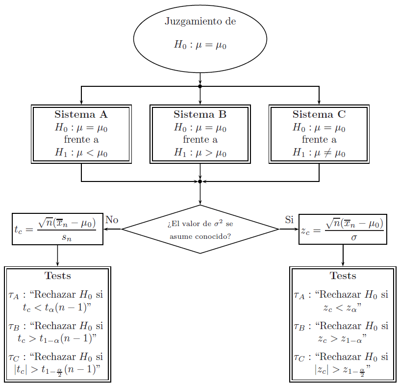

```{r setup, include=FALSE}
knitr::opts_chunk$set(echo = TRUE)
```

# Introducción

Se asume que $X_1,\ldots,X_n$ es una muestra aleatoria tal que $X_i\stackrel{\text{IID}}{\sim} \textsf{N}(\mu, \sigma^2)$, para $i=1,\ldots,n$. 

Antes de implementar las pruebas, es **indispensable verificar que la distribución de la variable aleatoria objeto de estudio tenga distribución Normal**, de lo contrario, se deben utilizar otras técnicas de inferencia (e.g., **Bootstrap**).


# Para la media pobacional $\mu$

El proceso de prueba para $\mu$ se puede resumir con el siguiente esquema:

```{r, eval = TRUE, echo=FALSE, out.width="90%", fig.pos = 'H', fig.align = 'center'}

```


**Observaciones**

Se pueden utilizar estas pruebas de acuerdo con la condición de $\sigma$ siempre que:

- La distribución de la **población es Normal**, sin importar el tamaño de la muestra.
- El **tamaño de la muestra es grande** para aplicar los teoremas de convergencia.


## Ejemplo

Se **simula** una muestra de 50 estudiantes para determinar si en promedio los estudiantes no tienen sobrepeso (IMC < 25) con un nivel de significancia del $5\%$. 

**Solución**

El sistema de hipótesis que se quiere probar es:

$$H_0:\mu= 25\qquad\text{  frente a  }\qquad H_1: \mu< 25$$
```{r}
# simulación de la muestra aleatoria
set.seed(123)
imc <- rnorm(n = 50, mean = 25.5, sd = 1)
head(imc)
```

```{r}
# prueba sobre el promedio poblacional
t.test(x = imc, alternative = "less", mu = 25, conf.level = 0.95)
```

Dado que el valor $p > 0.05$, con una confiabilidad del 95\% no existe suficiente evidencia empírica para establecer que en promedio los estudiantes no tienen sobrepeso.

Para probar los **supuestos del modelo** se debe probar el sistema de hipótesis:

$$
H_0: \text{La población tiene distribución Normal}
\qquad\text{  frente a  }\qquad 
H_1: \text{La población no tiene distribución Normal}
$$

```{r}
# prueba de normalidad de Shapiro-Wilk
shapiro.test(imc)
```


```{r}
# prueba de normalidad de Kolmogorov-Smirnov
nortest::lillie.test(imc)
```


```{r}
# prueba de normalidad de Anderson-Darling
nortest::ad.test(imc)
```


Dado que el valor $p > 0.05$, con una confiabilidad del 95\% no existe suficiente evidencia empírica para establecer el IMC de la población no tiene distribución Normal.


```{r}
# descripcion
summary(imc)
```

```{r,fig.width=8,fig.height=4,fig.align='center'}
# grafico
par(mfrow = c(1,2))
# histograma
hist(x = imc, freq = F, col = "white", xlim = c(21,29), ylim = c(0,0.5), xlab = "Balance", ylab = "Densidad", main = "")
curve(expr = dnorm(x, mean = mean(imc), sd = sd(imc)), col = 2, add = TRUE)
# grfico cuantil-cuantil
qqnorm(imc, xlab = "Cuantiles normales", ylab = "Cuantiles observados", main = "")
qqline(imc, col = 2)
```


# Para la varianza poblacional $\sigma^2$

El proceso de prueba para $\mu$ se puede resumir con el siguiente esquema:

```{r, eval = TRUE, echo=FALSE, out.width="90%", fig.pos = 'H', fig.align = 'center'}

```

Generalmente, $\epsilon=\alpha/2$ y $\delta=1-\alpha/2$.

## Ejemplo

Una pieza debe fabricarse con medidas de tolerancia muy estrechas para que
sea aceptada por el cliente. Las especificaciones de producción indican que la varianza máxima
en la longitud de la pieza debe ser 0.0004. En 30 piezas la varianza muestral encontrada
es 0.0005. Use un nivel de significancia de 0.05 para probar si se está violando la especificación acerca de la variabilidad
poblacional.

**Solución**

```{r}
var1_test_V1 <- function(s2, n, sigma2, alternativa = "diferente", confianza = 0.95) {
  # informacion muestral
  s2 <- as.numeric(s2)
  n  <- as.numeric(n)
  # estadistico de prueba
  chi <- (n-1)*s2/sigma2
  # valor p
  if (alternativa == "menor") {
    p <- pchisq(q = chi, df = n-1, lower.tail = T)
  }
  if (alternativa == "mayor") {
    p <- pchisq(q = chi, df = n-1, lower.tail = F)
  }
  if (alternativa == "diferente") {
    p1 <- pchisq(q = chi, df = n-1, lower.tail = T)
    p2 <- pchisq(q = chi, df = n-1, lower.tail = F)
    p  <- 2*min(p1,p2)
  }
  # salida
  return(p)
}
```


```{r}
var1_test_V2 <- function(s2, n, sigma2, alternativa = "diferente", confianza = 0.95) {
  # informacion muestral
  s2 <- as.numeric(s2)
  n  <- as.numeric(n)
  # estadistico de prueba
  chi <- (n-1)*s2/sigma2
  # valor p
  if (alternativa == "menor") {
    p <- pchisq(q = chi, df = n-1, lower.tail = T)
  }
  if (alternativa == "mayor") {
    p <- pchisq(q = chi, df = n-1, lower.tail = F)
  }
  if (alternativa == "diferente") {
    p1 <- pchisq(q = chi, df = n-1, lower.tail = T)
    p2 <- pchisq(q = chi, df = n-1, lower.tail = F)
    p  <- 2*min(p1,p2)
  }
  # imprimir en pantalla
  cat("Prueba sobre la varianza poblaciónal bajo normalidad \n",
      "El valor valor p es ", p, sep = "")
}
```


El sistema de hipótesis que se quiere probar es:

$$H_0:\sigma^2 = 0.0004\qquad\text{  frente a  }\qquad H_1: \sigma^2 > 0.0004$$


```{r}
# prueba sobre la varianza poblacional
var1_test_V1(s2 = 0.0005, n = 30, sigma2 = 0.0004, alternativa = "mayor", confianza = 0.95)
```

```{r}
# prueba sobre la varianza poblacional
var1_test_V2(s2 = 0.0005, n = 30, sigma2 = 0.0004, alternativa = "mayor", confianza = 0.95)
```

Dado que el valor $p > 0.05$, con una confiabilidad del 95\% no existe suficiente evidencia empírica para establecer que se está violando la especificación acerca de la variabilidad
poblacional del proceso de producción.


# Para la proporción poblacional $\pi$

Se considera una muestra aleatoria $X_1,\ldots,X_n$ de una población $\textsf{Bernoulli}(\pi)$. 

Se tienen los siguientes sistemas de hipótesis:

$$\text{Sistema A: }\qquad H_0:\pi=\pi_0\qquad\text{  frente a  }\qquad H_1:\pi<\pi_0$$
$$\text{Sistema B: }\qquad H_0:\pi=\pi_0\qquad \text{  frente a  }\qquad H_1:\pi>\pi_0$$
$$\text{Sistema C: }\qquad H_0:\pi=\pi_0\qquad \text{  frente a  }\qquad H_1:\pi\neq\pi_0$$
El estadístico de prueba es

$$Z=\frac{P-\pi_0}{\sqrt{\frac{\pi_0(1-\pi_0)}{n}}}$$

y los tests son respectivamente:

$$\tau_A:\qquad \text{Rechazar }H_0\text{ si }z_c<z_{\alpha}$$

$$\tau_B:\qquad \text{Rechazar }H_0\text{ si }z_c>z_{1-\alpha}$$

$$\tau_C:\qquad \text{Rechazar }H_0\text{ si }|z_c|>z_{1-\alpha/2}$$

## Ejemplo

Se observa una muestra aleatoria de 300 componentes electrónicos fabricados mediante un proceso específico y se encuentra que 25 son defectuosos. 
Sea $\pi$ la proporción poblacional de componentes fabricados mediante este proceso que presentan defectos. El responsable del proceso de producción afirma
que $p \leq 0.05$. ¿La muestra proporciona suficiente evidencia para rechazar la afirmación?


# Referencias {-}

```{r, eval = TRUE, echo=FALSE, out.width="25%", fig.pos = 'H', fig.align = 'center'}
knitr::include_graphics("mayorga.jpg")
```

```{r, eval = TRUE, echo=FALSE, out.width="25%", fig.pos = 'H', fig.align = 'center'}
knitr::include_graphics("ramachandran_tsokos.png")
```

```{r, eval = TRUE, echo=FALSE, out.width="25%", fig.pos = 'H', fig.align = 'center'}
knitr::include_graphics("casella_berger.jpg")
```
