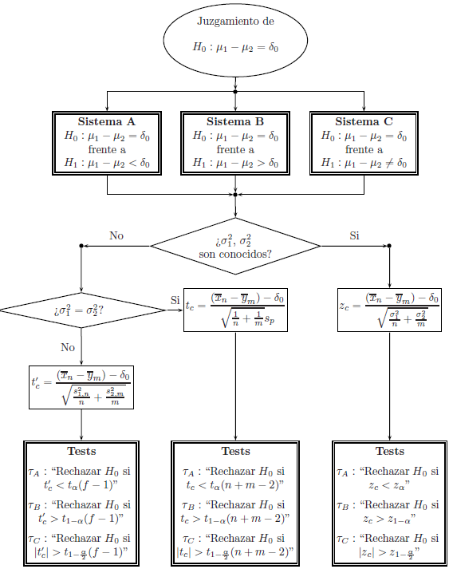

```{r setup, include=FALSE}
knitr::opts_chunk$set(echo = TRUE)
```

\newcommand{\ceil}[1]{\left\lceil {#1} \right\rceil}

# Introducción

Se consideran **dos poblaciones**, a saber, $X\sim \textsf{N}(\mu_X,\sigma_X^2)$ y $Y\sim \textsf{N}(\mu_Y,\sigma_Y^2)$, de las cuales se tienen **muestras aleatorias independientes** $X_1,\ldots,X_{n_X}$ y $Y_1,\ldots,Y_{n_Y}$, respectivamente. 

El objetivo es **comparar los parámetros** de las dos poblaciones.

# Para la diferencia de medias pobacional $\mu_X - \mu_Y$

El proceso de prueba para $\mu_X - \mu_Y$ se puede resumir con el siguiente esquema:

```{r, eval = TRUE, echo=FALSE, out.width="90%", fig.pos = 'H', fig.align = 'center'}

```

donde


$$
f=\ceil{\frac{\left(\frac{s^2_{X}}{n_X}+\frac{s^2_{Y}}{n_Y} \right)^2 }{\frac{\left( \frac{s^2_{X}}{n_X}\right)^2 }{n_X-1}+\frac{\left( \frac{s^2_{Y}}{n_Y}\right)^2 }{n_Y-1}}}
$$

y

$$
S_p=\sqrt{\frac{(n_X-1)S^2_{X}+(n_Y-1)S^2_{Y}}{n_X+n_Y-2}}
$$

Cuando se quiere probar la **igualdad de las medias** se usa $\delta_0=0$.


## Ejemplo 

Simular dos muestras aleatorias, una de tamaño $n_X=25$ de una población Normal con media $\mu_X=5$ y varianza $\sigma_X^2=0.50$, y otra de tamaño $n_Y=20$ de una población Normal con media $\mu_Y=4$ y varianza $\sigma_Y^2=0.25$. Usando estas muestras, probar al 95\% de confianza el sistema de hipótesis

$$H_0:\mu_X-\mu_Y = 0\qquad\text{  frente a  }\qquad H_1:\mu_X-\mu_Y\neq 0\,.$$

```{r}
# simulacion de los datos
set.seed(1234)
x <- rnorm(n = 25, mean = 5, sd = 0.50)
y <- rnorm(n = 20, mean = 4, sd = 0.25)
```


```{r}
# inspeccionar los datos
head(x)
head(y)
```

```{r}
# tendencia
summary(x)
summary(y)
```


```{r}
# diagrama de caja
boxplot(x, y, border = c("darkblue","black"), col = "white", boxwex = 0.4, outline = F)
points(x = jitter(x = rep(1,25), amount = 0.08), y = x, pch = 16, col = adjustcolor("blue",  0.5))
points(x = jitter(x = rep(2,20), amount = 0.08), y = y, pch = 16, col = adjustcolor("black", 0.5))
```

```{r}
# prueba normalidad
shapiro.test(x)
shapiro.test(y)
```


```{r}
# prueba de diferencia de medias
t.test(x = x, y = y, alternative = "two.sided", mu = 0, paired = FALSE, var.equal = FALSE, conf.level = 0.95)
```


# Prueba de homocedasticidad

Se tienen los siguientes sistemas de hipótesis:

$$\text{Sistema A: }\qquad H_0:\sigma_1^2=\sigma_2^2\qquad\text{  frente a  }\qquad H_1:\sigma_1^2<\sigma_2^2$$
$$\text{Sistema B: }\qquad H_0:\sigma_1^2=\sigma_2^2\qquad \text{  frente a  }\qquad H_1:\sigma_1^2>\sigma_2^2$$
$$\text{Sistema C: }\qquad H_0:\sigma_1^2=\sigma_2^2\qquad \text{  frente a  }\qquad H_1:\sigma_1^2\neq\sigma_2^2$$
El estadístico de prueba es

$$F=\frac{S^2_X}{S^2_Y}$$

y los tests son respectivamente:

$$\tau_A:\qquad \text{Rechazar }H_0\text{ si }f_c<\textsf{F}_{n_X-1,n_Y-1,\alpha}$$

$$\tau_B:\qquad \text{Rechazar }H_0\text{ si }f_c>\textsf{F}_{n_X-1,n_Y-1,1-\alpha}$$

$$\tau_C:\qquad \text{Rechazar }H_0\text{ si }f_c<\textsf{F}_{n_X-1,n_Y-1,\alpha/2}\text{  o  } f_c>\textsf{F}_{n_X-1,n_Y-1,1-\alpha/2}$$

## Ejemplo

Hacer la prueba de homocedasticidad a dos colas usando los datos de la simulación anterior.

```{r}
var.test(x = x, y = y, ratio = 1, alternative = "two.sided", conf.level = 0.95)
```


```{r}
# estadistico de prueba
(est <- var(x)/var(y))
```


```{r}
# percentiles
qf(p = 0.025, df1 = 25-1, df2 = 20-1, lower.tail = TRUE )
qf(p = 0.025, df1 = 25-1, df2 = 20-1, lower.tail = FALSE)
```


```{r}
# valor p
(p1 <- pf(q = est, df1 = 25-1, df2 = 20-1, lower.tail = TRUE ))
(p2 <- pf(q = est, df1 = 25-1, df2 = 20-1, lower.tail = FALSE))
(p  <- 2*min(p1,p2))
```


# Para la diferencia de proporciones poblacional $\pi_X-\pi_Y$

Se consideran **dos poblaciones**, a saber, $X\sim Ber(\pi_X)$ y $Y\sim Ber(\pi_Y)$, de las cuales se tienen las **muestras aleatorias independientes** $X_1,\ldots,X_{n_X}$ y $Y_1,\ldots,Y_{n_Y}$, respectivamente.

Se tienen los siguientes sistemas de hipótesis:

$$\text{Sistema A: }\qquad H_0:\pi_X-\pi_Y=\delta_0\qquad\text{  frente a  }\qquad H_1:\pi_X-\pi_Y<\delta_0$$
$$\text{Sistema B: }\qquad H_0:\pi_X-\pi_Y=\delta_0\qquad \text{  frente a  }\qquad H_1:\pi_X-\pi_Y>\delta_0$$
$$\text{Sistema C: }\qquad H_0:\pi_X-\pi_Y=\delta_0\qquad \text{  frente a  }\qquad H_1:\pi_X-\pi_Y\neq\delta_0$$
El estadístico de prueba es

$$Z=\frac{(P_X-P_Y) - \delta_0}{\sqrt{\frac{P_X(1-P_X)}{n_X}+\frac{P_Y(1-P_Y)}{n_Y}}}$$

y los tests son respectivamente:

$$\tau_A:\qquad \text{Rechazar }H_0\text{ si }z_c<z_{\alpha}$$

$$\tau_B:\qquad \text{Rechazar }H_0\text{ si }z_c>z_{1-\alpha}$$

$$\tau_C:\qquad \text{Rechazar }H_0\text{ si }|z_c|>z_{1-\alpha/2}$$


## Ejercicio

Los extractos de *St. John's Wort* se utilizan ampliamente para tratar la depresión. Un artículo del número del 18 de abril de 2001 del *Journal of the American Medical Association*, títulado *Effectiveness of St. John's Wort on Major Depression: A Randomized Controlled Trial*, comparó la eficacia de un extracto estándar de *St. John’s Wort* con un placebo en 200 pacientes  diagnosticados de depresión mayor. 

Los pacientes fueron asignados aleatoriamente a dos grupos (50/50). Un grupo recibió la hierba y el otro recibió el placebo. Después de 8 semanas, 19 de los pacientes tratados con placebo mostraron una mejoría y 27 de los tratados con *St. John's Wort* mejoraron. ¿Existe alguna razón para creer que el tratamiento es eficaz para tratar la depresión mayor? Use una confiabilidad del 95\%.


# Prueba de independencia entre dos variables categóricas

La prueba de independencia se utiliza cuando se quiere probar **si existe una relación entre dos variables categóricas**. 

El sistema de hipótesis es:
$$
H_0:\text{Las variables son independientes}
$$

$$
\text{frente a}
$$

$$
H_1:\text{Las variables no son independientes.}
$$

El estadístico de prueba es:
$$
\chi^2=\sum_{i=1}^{k}\sum_{j=1}^{p}\frac{(n_{ij}-e_{ij})^2}{e_{ij}}\,.
$$
donde $k$ es el número de categorías de $X$, $p$ es el número de categorías de $Y$, $n_{ij}$ es la frecuencia absoluta de la $i$-ésima categoría de $X$ y la $j$-ésima categoría de $Y$, y $e_{ij}=\frac{n_{i\bullet}n_{\bullet j}}{n_{\bullet\bullet}}$ es la frecuencia esperada bajo la hipótesis de independencia.

El test es:
$$
\tau:\qquad \text{Rechazar }H_0\text{ si }\chi^2_c>\chi^2_{(k-1)(p-1),1-\alpha}\,.
$$

## Ejemplo

Se seleccionó una muestra de 500 niños para determinar si existe una asociación entre el nivel socio-económico y la presencia o ausencia de un defecto de pronunciación. Con base en los resultados de la tabla, ¿qué se puede concluir utilizando un 5\% de significancia?

$X$: Defecto en la pronunciación.

$Y$: Nivel socio-económico.

| $X / Y$ | Alto | Medio-alto | Medio-bajo | Bajo  |
|:-------:|:----:|:----------:|:----------:|:-----:|
| Sí      | 8    | 24         | 32         | 27    |
| No      | 42   | 121        | 138        | 108   |

El sistema de hipótesis está dado por:

$$H_0:\text{No existe una asociación entre el defecto en la pronunciación y el nivel socio-económico}$$
$$\text{frente a}$$
$$H_1:\text{Sí existe una asociación entre el defecto en la pronunciación y el nivel socio-económico}$$

```{r}
#tabla de frecuencias
tabla <- matrix(data = c(8,24,32,27,42,121,138,108), nrow = 2, ncol = 4, byrow = T)
colnames(tabla) <- c("Alto","Medio-alto","Medio-bajo","Bajo")
rownames(tabla) <- c("Con defecto", "Sin defecto")
print(tabla)
```


```{r}
# prueba de hipótesis
chisq.test(x = tabla)
```


```{r}
# percentil
qchisq(p = 0.05, df = 3, lower.tail = F)
```


Como el valor $p=0.8577>0.05$, se concluye que no hay suficiente evidencia estadística para afirmar que existe una asociación entre el nivel socio-económico y tener un defecto de pronunciación.


# Referencias {-}

```{r, eval = TRUE, echo=FALSE, out.width="25%", fig.pos = 'H', fig.align = 'center'}
knitr::include_graphics("mayorga.jpg")
```

```{r, eval = TRUE, echo=FALSE, out.width="25%", fig.pos = 'H', fig.align = 'center'}
knitr::include_graphics("ramachandran_tsokos.png")
```

```{r, eval = TRUE, echo=FALSE, out.width="25%", fig.pos = 'H', fig.align = 'center'}
knitr::include_graphics("casella_berger.jpg")
```
